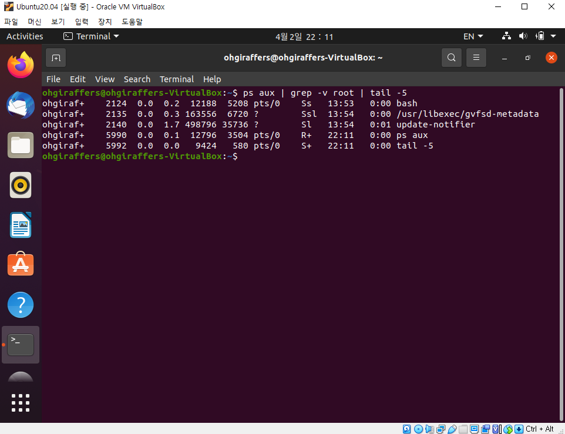

# 10. 우분투 프로세스 명령어

## 10-1. 프로세스 상태 관련 명령어

### 10-1-1. ps
> 프로세스의 현재 상태를 출력하는 명령어이다. 현재 기동중인 프로세스를 확인할 때 많이 사용한다.
> 주로 ps -ef 라는 명령을 사용하여 많이 확인한다.
> 
> 아래 옵션 말고도 수많은 옵션이 존재한다.
> 
> ps [OPTIONS]
> 
> 프로세스 상태 확인 시에 ps -ef | grep {특정 검색어} 같이 입력하면 수많은 프로세스에서 특정 검색어가 들어간
> 프로세스를 검색할 수 있다.

| 옵션 | 설명 |
| :---: | --- |
| -e | 현재 실행 중인 모든 프로세스 정보 출력|
| -f | 모든 정보 확인|
| aux | 백그라운드 프로세스 목록까지 확인한다.|
| -A | 모든 프로세스를 출력한다.|
| -N | -A 옵션과 비슷하나 ps 프로세스를 제외하고 출력한다.|
| -a | 세션 리더 및 터미널에 속하지 않는 프로세스를 제외하고 출력한다.|
| -d | 세션 리더를 제외한 모든 프로세스를 출력한다.|
| T | 현재 터미널에서의 모든 프로세스를 출력한다.|
| a | 현재 터미널의 사용자 고유 프로세스를 출력한다.|
| r | 현재 실행 중인 프로세스를 출력한다.|
| x | 터미널이 없는 프로세스를 출력한다.|

- 현재 실행중인 프로세스 모든 정보 중에 bash 라는 이름을 가진 프로세스 확인

- 백그라운드 프로세스 목록 출력하되 root 가 돌리는 것이 아닌 것중에 마지막 5줄 출력하는 명령

### 10-1-2. pstree
> 실행 중인 프로세스들을 트리구조로 보여주는 명령어이다.
> 
> pstree [OPTIONS]

| 옵션 | 설명 |
| :---: | --- |
| -p | 프로세스 ID 표시|
| -n | 프로세스 ID를 정렬해서 표시|
| -a | 명령행 인자를 포함한 정보를 트리구조에 표시|
| -h | 현재 프로세스와 해당 프로세스의 부모 프로세스를 음영으로 강조해서 표시|

### 10-1-3. kill
> 프로세스 종료 시그널을 커널에 보내는 명령어이다. 시스템에 이상이 생겨 종료를 시켜야할 때 사용한다.
> 프로세스의 아이디인 PID를 이용하여 프로세스를 죽일 수 있다. 이 PID는 ps 명령을 통해 확인한다.
> 
> kill [OPTIONS] {PID}

| 옵션 | 설명 |
| :---: | --- |
| -9 | 프로세스를 강제로 종료시킨다.|
| -15 | 프로세스를 정상 종료시킨다.|
| -l | 프로세스 종료 시그널 정보를 확인할 수 있다.|

- kill -9 를 사용하여 특정 프로세스 종료

- kill -l 실행한 결과

### 10-1-4. top
> 현재 실행되고 있는 Task 들을 유동적으로 관착 가능한 명령어이다. 윈도우의 작업관리자랑 비슷하다.
>
> 
> - Load Average : 해당 값은 CPU Load의 이동 평균을 표시한다. 앞에서부터 1분, 5분, 15분 평균값이다. CPU Load란 CPU가 수행하는 작업의 양이다.
> - Tasks : 현재 프로세스들의 상태를 나타내준다. 
>   - Total - 전체 프로세스 갯수
>   - running - 기동중인 프로세스 갯수
>   - sleeping - 대기상태인 프로세스 갯수
>   - stopped - 종료된 프로세스 갯수 
>   - zombies - 좀비상태인 프로세스 갯수(Process는 자신을 실행시킨 부모 프로세스가 존재하는데 부모 프로세스가 먼저 종료된다면 root와의 연결고리가 끊긴 process, 즉 좀비 프로세스가 생성된다)
> - %Cpu : CPU가 어떻게 사용되고 있는지 사용율을 보여준다.
>   - us : 프로세스의 유저 영역에서의 CPU 사용률
>   - sy : 프로세스의 커널 영역에서의 CPU 사용률
>   - ni : 프로세스의 우선순위(priority) 설정에 사용하는 CPU 사용률
>   - id : 사용하고 있지 않는 비율
>   - wa : IO가 완료될때까지 기다리고 있는 CPU 비율
>   - hi : 하드웨어 인터럽트에 사용되는 CPU 사용률
>   - si : 소프트웨어 인터럽트에 사용되는 CPU 사용률
>   - st : CPU를 VM에서 사용하여 대기하는 CPU 비율
> - Mem & Swap : Mem은 메모리에서 사용중인 비율을 보여주고, Swap은 Mem이 모두 가동중일때 물리적 디스크에서 메모리처럼 지원을 해주는 비율을 보여준다.
>   - total : 총 메모리 양
>   - free : 사용가능한 메모리 양
>   - used : 사용중인 메모리 양
> 
> 하단부의 디테일 영역은 프로세스에 대한 상세한 내용이 출력된다.
> - PID : PID는 프로세스 ID이며 프로세스를 구분하기 위한 겹치지않는 고유한 값
> - USER : 해당 프로세스를 실행한 USER 이름 또는 효과를 받는 USER의 이름
> - PR & NI  
>   - PR : 커널에 의해서 스케줄링되는 우선순위
>   - NI : PR에 영향을 주는 nice라는 값
> - VIRT, RES, SHR, %MEM : 해당 필드들은 프로세스의 메모리와 관련있다.
>   - VIRT : 프로세스가 소비하고 있는 총 메모리이며 프로그램이 실행중인 코드, heap, stack과 같은 메모리, IO buffer 메모리를 포함한다.
>   - RES : RAM에서 사용중인 메모리의 크기를 나타낸다.
>   - SHR : 다른 프로세스와의 공유메모리(Shared Memory)를 나타낸다.
>   - %MEM : RAM에서 RES가 차지하는 비율을 나타낸다.
> - S : 프로세스의 현재 상태를 나타낸다.
> - TIME+ : 프로세스가 사용한 토탈 CPU 시간
> - COMMAND : 해당 프로세스를 실행한 커맨드를 나타낸다.

