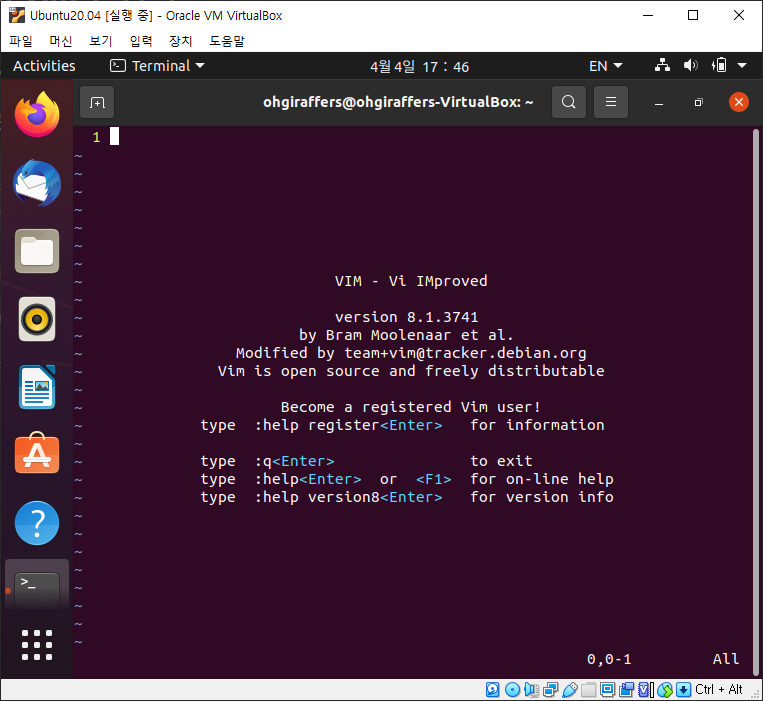
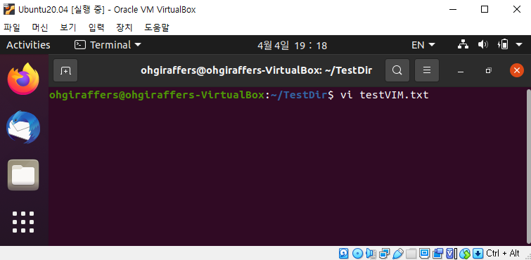
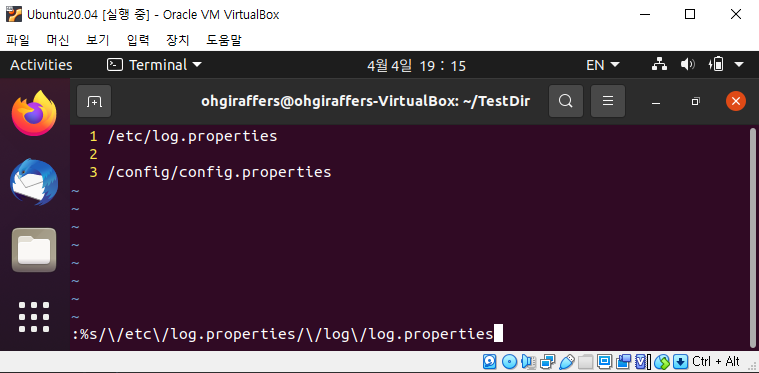
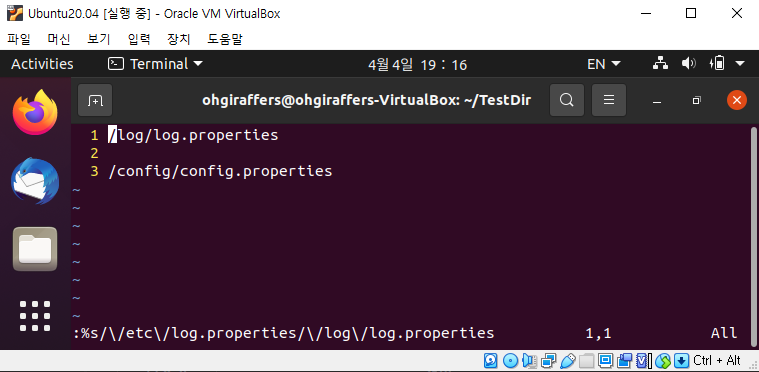

# 11. Vim 편집기

## 11-1. vim 이란?

### 11-1-1. vi 란?
> vi 란 유닉스 환경에서 사용되는 텍스트 편집기(editor)다.
> 1976년 빌 조이가 초기 BSD 릴리즈에 포함될 편집기로 만들었다. 
> vi 라는 이름은 한 줄씩 편집하는 줄단위 편집기가 아니라 한 화면을 편집하는 비주얼 에디터(Visual Editor)에서 유래됐다.

### 11-1-2. vim 이란?
> vim 이란 'Vi IMproved' 의 약어로 Bram Moolenaar가 만든 vi 호환 텍스트 편집기이다.
> vi와 호환되면서 독자적으로 다양한 기능이 추가되어 사용자의 편의를 향상시킨 편집기이다.
> 확장된 정규표현식 문법, 강력한 문법 강조기능, 다중 되돌리기, 유니코드를 비롯한 다국어지원 등이 강점이다.
> 
> vi, vim(이하 vi) 에는 크게 두가지 모드가 있다.
> - 명령모드
> - 입력모드

| 모드 | 역할 및 특징 |
| :---: | ----------- |
| 명령 모드 | vi을 실행하면 가장 먼저 Default로 진행되는 모드이며, 커서의 이동, 텍스트의 복사, 붙이기, 검색, 삭제 등이 가능하다. |
| 입력 모드 | 글자를 직접 입력할 수 있는 모드이다. 명령모드에서 입력모드로 전환하기 위해서는 i,a,o,l,A,O 와 같은 키를 누르면 된다.  입력모드로 전환되었을 때, vim 편집기 하단에 --INSERT--라고 표시가 된다.  입력모드에서 명령모드로 전환하는 방법은 esc를 누르면 된다. 

### 11-1-3. vi 실행하기
> vi를 터미널에서 입력하면 가장 먼저 '명령 모드' 로 실행이 된다. 이때는 텍스트를 직접 입력하는 것이 아닌,
> 다양한 단축키를 이용하여 복사, 삭제 등과 같은 작업을 진행한다.

- 터미널에서 vi를 입력한 모습
  

- vi를 실행할 때 파일명을 입력한 후 저장종료하게 되면 해당 파일이 생성된다.

### 11-1-4. 입력 모드 전환 명령어

| 단축키 | 설명 |
| :----: | ---- |
| i | 현재 커서 위치부터 입력 | 
| a | 현재 커서의 위치 다음 칸부터 입력 |
| o | 현재 커서의 다음 줄에 입력 |
| s | 현재 커서 위치의 한 글자를 지우고 입력 |
| shift + i | 현재 커서 줄의 맨 앞부터 입력 |
| shift + a | 현재 커서 줄의 맨 끝부터 입력 |
| shift + o | 현재 커서의 이전 줄부터 입력 |
| shift + s | 현재 커서의 한 줄을 지우고 입력 |

### 11-1-5.  커서 이동 명령어
> 처음 vi를 사용할 당시에는 키보드에 화살표나 페이지업/다운 키가 없기 때문에 커서 이동명령어가 따로 존재했다.
> 지금은 화살표와 페이지업/다운을 입력하면 되지만 그 외에 다른 유용한 키들은 알아두면 좋다.

| 단축키 | 설명 |
| :-----: | --- |
| h | 커서를 왼쪽으로 한 칸 이동 |
| j | 커서를 아래쪽으로 한 칸 이동 |
| k | 커서를 위로 한 칸 이동 |
| l | 커서를 오른쪽으로 이동 | 
| w | 다음 단어의 처음으로 이동 |
| ^ | 해당 줄의 첫 문자로 이동 |
| $ | 줄의 맨 끝으로 이동 (:$ 은 맨 마지막 라인으로 이동) |
| 0 | 줄의 맨 처음으로 이동 (:0 은 맨 처음 라인으로 이동) |
| shift + g | 맨 마지막 라인으로 이동 |
| gg | 맨 처음 라인으로 이동 |
| n + shift + g | n번째 행으로 이동 |
| :n + enter | n번째 행으로 이동 |
| shift + h | 화면의 첫 줄로 이동 |
| shift + m | 화면의 중간으로 이동 | 
| shift + l | 화면의 끝 줄로 이동 | 
| ctrl + b | 이전 화면으로 이동(= pageUp) |
| ctrl + f | 다음 화면으로 이동(= pageDown) |

### 11-1-6. 복사, 붙여넣기, 삭제 명령어
> 우분투에서는 크게 문제없이 백스페이스나 Delete 버튼이 작 작동하지만, 몇몇 OS에서는 잔상이 남거나 제대로 작동이 안되는 경우가 생긴다.
> 그래서 해당 단축키를 알아두는 것이 좋다.

| 단축키 | 설명 |
| :-----: | --- |
| x | 현재 커서가 위치한 문자 삭제 |
| dw | 현재 커서가 닿아있는 단어 삭제 |
| dd | 현재 커서가 위치한 라인 삭제 |
| 숫자 dd | 현재 커서부터 숫자만큼 라인 삭제 | 
| yy | 현재 커서가 있는 라인 복사 | 
| 숫자 yy | 현재 커서부터 숫자만큼 라인 복사 | 
| p | 복사한 내용을 현재 행부터 붙여 넣기 |
| shift + p | 복사한 내용을 현재 라인 이전에 붙여 넣기 |

### 11-1-7. 되돌리기 및 검색
> 이전에 작업했던 내용을 되돌리는 단축키와 검색시 사용하는 단축키이다. 

| 단축키 | 설명 |
| :-----: | --- |
| u | 직전에 내린 명령 취소 | 
| /str + enter | 'str'와 같은 문자열을 현재 커서가 위치한 곳부터 아래방향으로 검색 |
| ?str + enter | 'str'와 같은 문자열을 현재 커서가 위치한 곳부터 윗방향으로 검색 |
| n | 찾은 문자 중에서 다음 문자로 이동 | 
| shift + n | n 이 아래로 검색을 계속 내려가는 거라면 해당 명령은 위로 검색 |

### 11-1-8. 텍스트 치환
> 특정 단어를 다른 특정 단어로 한번에 바꾸고 싶을 때 사용하기에 유용한 기능이다. 명령모드에서 실행한다.
>
> :%s/기존단어/새로운단어[/OPTIONS] 와 같이 사용한다.

| 옵션 | 설명 |
| :-----: | --- |
| i | 대소문자 구분없이 치환 |
| g | 파일에 있는 모든 단어에 적용(이 옵션이 없을 시 하나의 줄에서 첫번째로 매칭되는 단어만 치환됨) |
| c | 바뀔 단어마다 확인하여 승인시 변경 적용(n : 다음 단어로, y : 해당 단어 변경) |

- 경로 치환 방법 (슬래시는 특수무자이기 문에 이스케이프문자 \ 를 활용해야 한다)

### 11-1-9. vi 종료하기
> vi를 종료하는 방법은 크게 3가지 방법이 있다. 단순 종료, 강제 종료, 저장후 종료.
> 입력모드 상태라면 esc로 명령모드로 변경후 ":" 입력한 다음 각 종료방법에 맞게 명령을 입력해주면 된다.

| 단축키 | 설명 |
| :-----: | --- |
| :q | vi 편집기 단순 종료. 수정한 것이 없을 때 사용 |
| :q! | vi 편집기 강제 종료. 이전에 수정한 내용을 반영하지 않고 강제 종료 |
| :wq | vi 편집기 저장 후 종료. 수정된 내용을 저장한 다음 종료 |
