# 12. SSH

## 12-1. SSH 개요

### 12-1-1. SSH란?
> SSH란 Secure Shell Protocol, 즉 네트워크 프로토콜의 하나로 컴퓨터와 컴퓨터가 인터넷과 같은 Public Network를 통해
> 서로 통신을 할 때 사용하는 프로토콜이다. 대표적으로 사용하는 용도로는 두가지가 있다.
> 
> 1. 원격 제어
> 2. 데이터 전송
> 
> 원격에 있는 컴퓨터를 제어하기 위해서 직접 가지 않고 해당 프로토콜을 통해 간편하게 원격제어를 할 수 있으며, 데이터 전송도 가능하다.
> 또한 FTP나 Telnet보다 보안적으로 뛰어나기 때문에 SSH를 이용하는 것을 추천한다.

### 12-1-2. SSH이 안전한 이유
> SSH는 클라이언트-서버 모델로 동작하며 비대칭키 방식, 대칭키 방식, 해시알고리즘을 사용하여 인증 및 암호화를 수행한다. 

| 암호화방식 | 설명 | 
|---------| ----|
| 비대칭키 방식 | 키 교환, 클라이언트 인증, 서버 인증에 사용 |
| 대칭키 방식 | 클라이언트 - 서버 간 전체 연결을 암호화하는데 사용 |
| 해시 알고리즘 | 패킷의 무결점을 확인하기 위해 사용 |

### 12-1-4. SSH 작동 원리

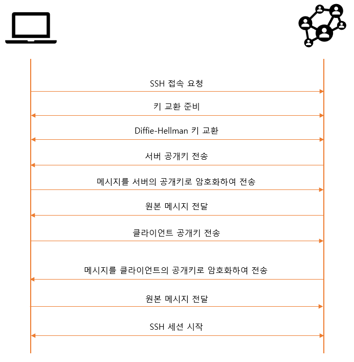

1. 클라이언트는 서버에 원격 접속하기 위해 연결을 설정하는 프로세스를 시작  
    - SSH는 기본적으로 22번 포트를 사용하여 통신
2. 서버는 자신의 공개키를 클라이언트에 전송한다.
    - 클라이언트로부터 SSH 접속 요청을 받으면 서버는 공개키를 클라이언트에 전송
    - 클라이언트는 서버로부터 전달받은 공개키를 로컬에 저장
3. 클라이언트와 서버는 여러 Parameter들을 주고 받으며 보안 채널 확립
    - 클라이언트는 올바른 서버인지 확인
        - 난수생성
        - 공개키로 암호화하여 서버 전송 
        - 서버에서 난수값 해독후 클라이언트로 전송 
        - 일치하면 올바른 서버
    - 암호화된 통신을 위한 세션키 생성(대칭키 생성)
        - 대칭키는 비대칭키보다 빠르지만 키가 둘중에 하나라도 유출될 시 치명적이다는 단점
        - SSH에서는 디피-헬만 알고리즘을 통해 대칭키 생성
        - 세션 종료시 사라지는 임시 키
    - 서버에 접근할 수 있는 클라이언트인지 확인
        - 클라이언트는 인증할 키 쌍의 ID를 서버에 전송
        - 서버는 클라이언트가 접속하고자 하는 계정의 .ssh/authorized_keys 파일을 확인
        - ID에 매칭되는 공개키가 있을 시, 서버는 난수를 생성하고 클라이언트의 공개키로 암호화
        - 서버는 클라이언트에게 암호화된 메시지 전송
        - 클라이언트의 개인키를 통해 암호화된 메시지를 복호화하여 난수 추출
        - 클라이언트는 난수를 세션키와 결합하여 해시값 계산 후 서버 전송
        - 서버는 저장된 난수와 세션키를 결합하여 해시값 계산 후 비교
        - 일치할 시 클라이언트 인증
    - 클라이언트가 서버에 원격 접속

## 12-2. SSH 세팅

### 12-2-1. apt를 이용하여 SSH 설치
> apt 를 사용하여 SSH 서버를 설치한다. 우분투를 설치하면서 같이 설치되었을 수도 있다.

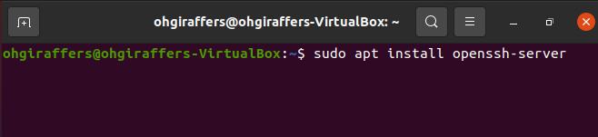

### 12-2-2. SSH 포트 관련 세팅
> 실제 서버 환경이라면 설치 이후 SSH 접속 포트를 바꾸는 걸 추천한다. 22번은 SSH의 기본 포트이면서 잘 알려진 포트이기 때문에
> 내가 알지 못하는 곳으로부터 접속시도가 수시로 들어올 수 있다.
> /etc/ssh/sshd_config 에서 변경 가능하다. #을 지우고 포트를 변경하면 된다.
> 
> 테스트 환경이라면 기본포트로 진행한다.

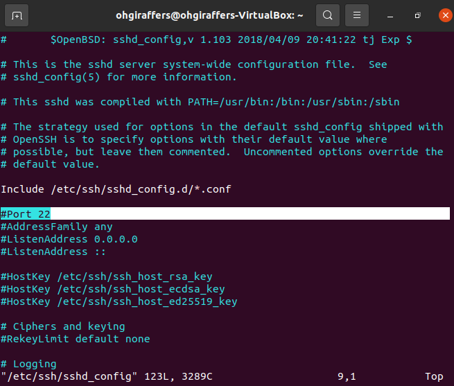

### 12-2-3. SSH 서비스 실행
> SSH 서비스 시작 명령을 입력하면 우분투는 SSH를 받아들일 준비가 된 상태다.
> 혹시나 방화벽을 실행한 적이 없다면 방화벽을 실행하고 예외포트에 SSH 서버 포트를 추가한다

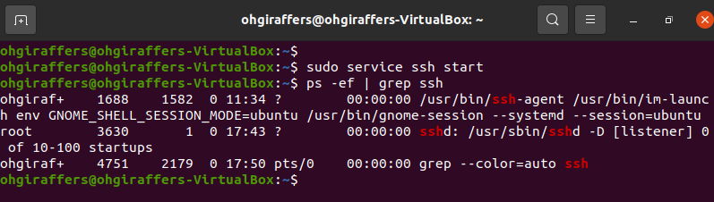

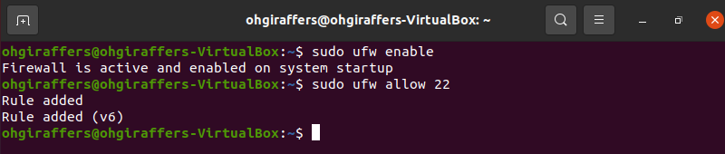

### 12-2-4. SSH 상태 확인
> SSH 를 실행시킨후 제대로 작동하고 있는지 확인할 수 있다.
> - sudo service ssh status
> 
> 서비스를 종료하려면 아래 명령어를 입력하면 된다.
> - sudo service ssh stop

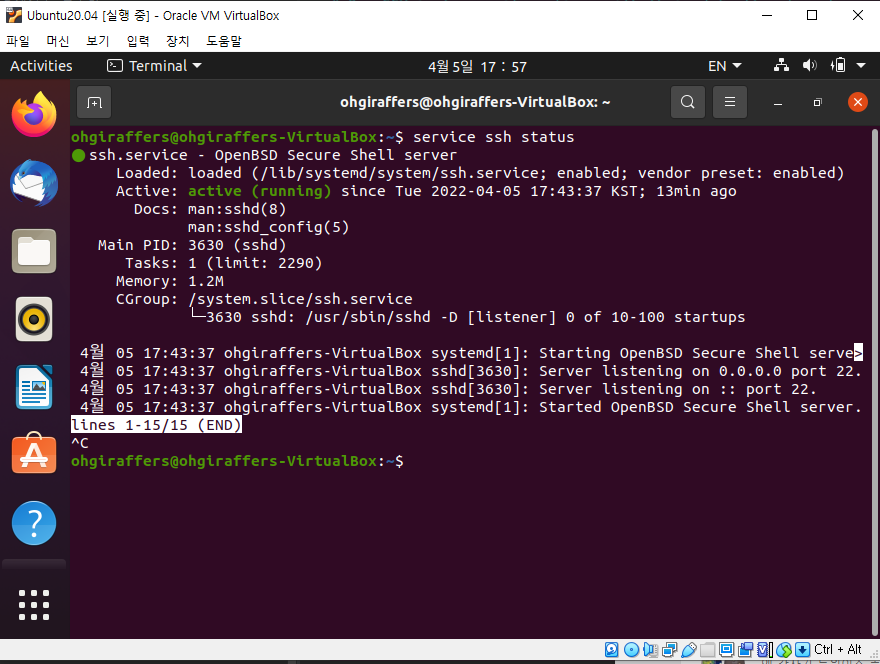

### 12-2-5. 아이피 확인
> 터미널에서 hostname -I(대문자 i) 를 입력하면 아이피를 확인할 수 있다.
> 버추얼박스와 우분투를 기본으로 세팅하였다면 아이피는 10.0.2.15 로 동일하다.

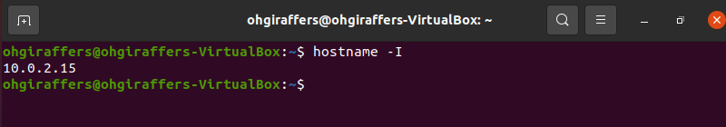

### 12-2-6. 포트 포워딩
> 포트포워딩은 버추얼박스 설정에서 진행해야한다.  

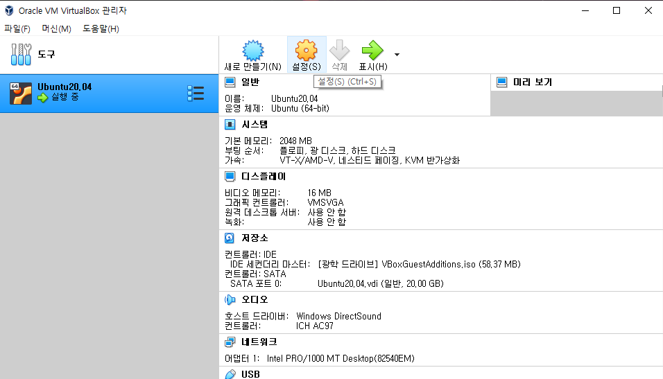

- 설정 > 네트워크 > 고급 > 포트포워딩 클릭

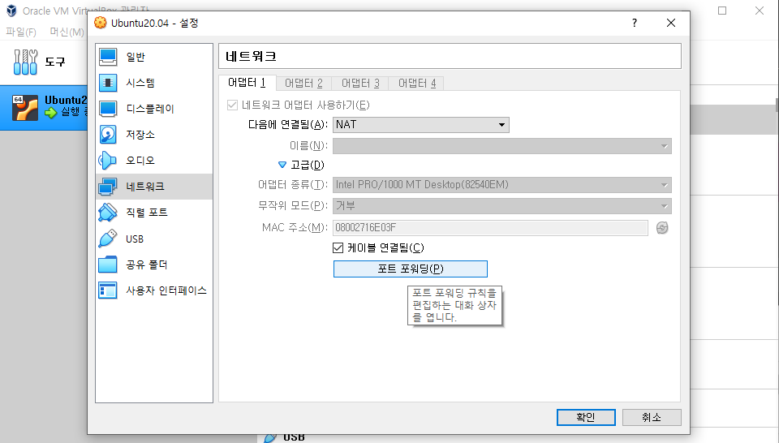

- 포트포워딩 규칙 추가
> - 호스트 IP : 윈도우 cmd 창에서 ipconfig로 확인된 버추얼 박스 호스트의 IPv4를 입력
> - 호스트 포트 : 되도록이면 Well-Known(1000번대 이하 포트) 포트를 피해서 임의로 지정
> - 게스트 IP : 우분투에서 확인한 IPv4 입력
> - 게스트 포트 : 우분투에서 설정한 SSH 포트 번호
> 
> 지정하였으면 확인하여 저장하고 설정이 제대로 적용될 수 있도록 우분투를 재시작한다.

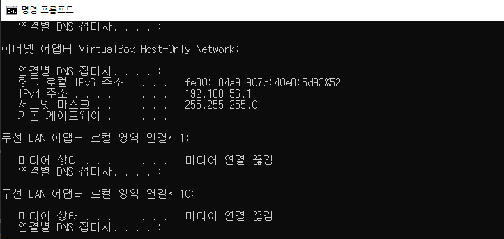

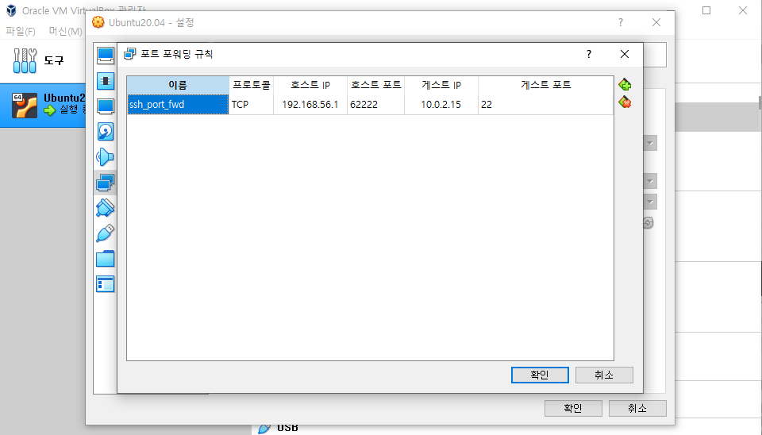

### 12-2-7. Putty로 접속
> putty를 다운받아 우분투에 접속 테스트를 해본다. 
> https://github.com/iPuTTY/iPuTTY/releases/tag/l0.70.2i 에서 iPutty 를 다운받아 진행하였다.
> 
> putty 를 실행하면 아래와 같은 창이 뜨는데 각자 PC와 세팅에 맞게 입력한다. 
> - 호스트 이름 : 포트포워딩에서 세팅한 호스트 IP
> - 포트 : 포트포워딩에서 세팅한 호스트 포트

- putty에 접속 정보 입력
> 처음 접속이라면 키 관련 알림창이 뜨는데 yes를 누르고 진행하면 된다. 

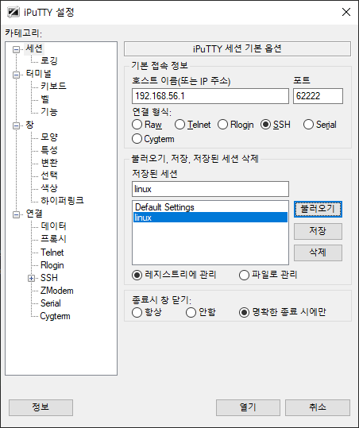

- 우분투 로그인 ID/PW 입력하면 접속이 가능하다.

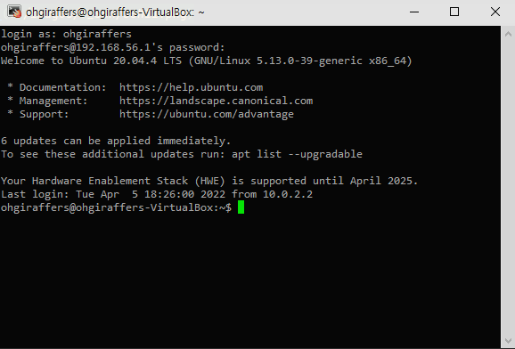
  

### 12-2-8. pspc 사용하여 리눅스로 파일 전송
> putty를 설치하거나 압축해제시 putty 파일 안에 pspc.exe 파일이 있다.
> 해당 실행 파일을 이용하여 리눅스로 파일 전송을 할 수 있다.

- 순서
1. 윈도우에서 cmd 실행
2. putty가 설치된 경로로 이동
3. pscp [-P 22번 외에 다른 포트라면 입력] [전송할 파일경로] [리눅스계정]@[리눅스접속 IP]:[다운받을 파일 경로]

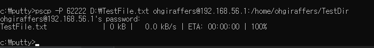

- 리눅스에 전송된 것을 확인할 수 있다

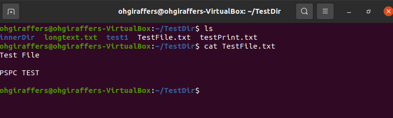

