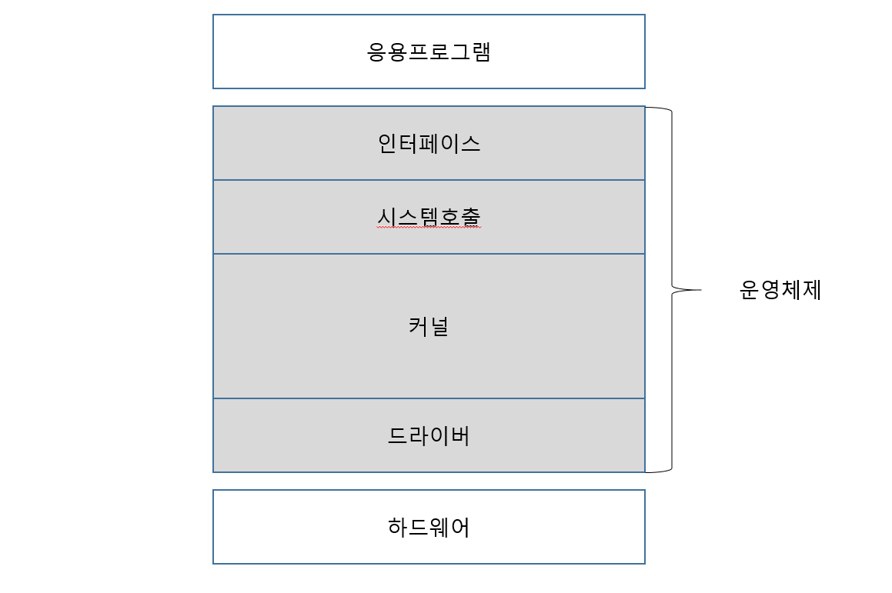

# 1. 운영체제 개요

## 1-1. 운영체제란

> 컴퓨터 시스템의 자원들을 효율적으로 관리하며, 사용자가 컴퓨터를 편리하고 효과적으로 사용할 수 있도록 환경을 제공하는 여러 프로그램들의 모임이다. 운영체제는 컴퓨터 하드웨어와 사용자 간의 인터페이스로서 동작하는 시스템 소프트웨어의 일종으로, 다른 응용프로그램이 유용한 작업을 할 수 있도록 환경을 제공해준다.

## 1-2. 운영체제의 기능

1. 프로세서, 기억장치, 입출력장치, 파일 및 정보 등의 자원을 관리한다.
2. 자원을 효율적으로 관리하기 위해 자원의 스케쥴링 기능을 제공한다.
3. 사용자와 시스템간의 편리한 인터페이스를 제공한다.
4. 시스템의 각종 하드웨어와 네트워크를 관리, 제어한다.
5. 데이터를 관리하고, 데이터 및 자원의 공유 기능을 제공한다.
6. 시스템의 오류를 검사하고 복구한다.
7. 자원 보고 기능을 제공한다.
8. 입출력에 대한 보조 기능을 제공한다.

### 1-2-1. 프로세스 관리
> 프로세스 관리는 운영체제 기능 중 가장 중요한 기능 중 하나다. 프로세스와 프로그램은 기본적으로 구분된다.
> 프로세스는 실제 메인 메모리에서 **실행 중인 프로그램(program in execution)** 을 말한다.
>
> 프로그램은 하드디스크와 같은 보조기억장치에서 **아무런 동작을 하지 않는 상태**이다.  
> 이를 어떠한 요청에 의해 메인 메모리에 할당하여 CPU를 사용하여 실행하게 되면 프로세스라고 부른다.

- 프로세스 관리의 주요 기능
  - 프로세스 생성과 소멸
  - 프로세스 활동 일시 중지, 활동 재개
  - 프로세스간 통신(InterProcess Communication : IPC)
  - 프로세스간 동기화
  - 교착상태 처리(Deadlock handling)

### 1-2-2. 주기억장치 관리
> 주기억장치 즉, 메인 메모리는 프로그램이 실행되기 위한 공간이다.  
> 주기억장치 관리에서는 메인 메모리를 효율적으로 사용하도록 관리한다.

- 주기억장치 관리의 주요 기능
  - 프로세스에게 메모리 공간 할당(allocation)
  - 메모리의 어느 부분이 어느 프로세스에게 할당되었는가 추적 및 감시
  - 프로세스 종료 시 메모리 회수(deallocation)
  - 메모리의 효과적 사용
  - 가상 메모리 관리(물리적 실제 메모리보다 큰 용량 사용 가능하게 함)

### 1-2-3. 파일 관리
> 디스크는 물리적으로 Track과 Sector로 구성되어 있으며, 여기서 파일이라는 논리적 관점으로 데이터를 바라보고 관리한다.
> 파일은 OS가 실행되는 컴퓨터에서 자주 볼수 있다. 
> 이는 복잡한 과정으로 하드디스크에 저장되어 있는 것을 사용자가 편리하게 사용할 수 있도록 **파일**이라는 논리적 형태로 운영체제에서 관리하여 보여준다.

- 파일 관리의 주요 기능
  - 파일의 생성과 삭제(file creation, deletion)
  - 디렉토리(Directory)의 생성과 삭제
  - 기본 동작 지원: open, close, read, write, create, delete
  - Track/sector - file 간의 매핑(mapping)
  - 백업(Backup)

### 1-2-4. 보조기억장치 관리
> 보조기억장치는 대표적으로 하드디스크, 플래시메모리가 있다.  
> 보조기억 장치 관리는 이 장치들 안에 어느곳이 사용되고 어느 곳이 사용되지 않는지를 관리하는 것이다.

- 보조기억장치 관리 주요 기능
  - 빈 공간 관리(Free space management)
  - 저장공간 할당(Storage allocation)
  - 디스크 스케줄링(Disk scheduling)

### 1-2-5. 입출력 장치 관리(I/O Device Management)
> 입출력 장치에는 키보드, 마우스, 프린터, 스피커, 마이크 등이 있다.
> 입출력 장치 관리는 이와 같은 여러 입출력 장치를 사용하기 위해 존재한다. 

- 입출력 장치 관리 주요 기능
  - 장치 드라이브(Device drivers)
  - 입출력 장치의 성능향상: buffering, caching, spooling

### 1-2-6. 시스템 콜 (System Call)
> 시스템 콜은 유저 프로세스에서 운영체제 서비스를 필요로 할 때 이를 받기 위해 사용하는 호출이다.

- 주요 시스템 콜
  - Process - end(정상 종료), abort(강제 종료), load, execute, create, terminate, get/set, attributes, wait event, signal event
  - Memory - allocate, free
  - File - create, delete, open, close, read, write, get/set attributes
  - Device - request, release, read, write, get/set attributes, attach/detach devices
  - information - get/set time, get/set system data
  - Communication - socket, send, receive

## 1-3. 운영체제의 종류 및 특징

### 1-3-1. Windows 계열의 운영체제 특징

- 사용자가 컨트롤하는 마우스의 아이콘을 이용하여 소프트웨어를 실행시킬 수 있는 편리한 인터페이스를 제공한다.
- 마이크로소프트사 만이 수정, 배포할 수 있으며 고객지원이 체계적이라는 장점을 가지고 있다.
- 문제점(버그 등)이 발견되었을 시 수정에 걸리는 시간이 길다는 단점이 있어 이러한 시간 차이를 이용하는 악성 해커들로 인하여 유닉스 계열의 운영체제에 비하여 보안이 취약하다는 문제점이 지속적으로 제기되고 있다.

### 1-3-2. 리눅스/유닉스 계열 운영체제의 특징

- 멀티태그스 기능에 초점을 맞추었으며 C언어로 재이식되어 대중화의 기반을 마련하였다.
- 리눅스는 유닉스의 커널이다. (자세한 설명은 리눅스에서 다시 다룰 예정임)
- 리눅스는 오픈소스 기반이기 때문에 수 천명 이상의 개발자들이 코드를 보고 update를 하고 있다. 따라서 버그 발생 시 다수의 개발자가 수정에 참여하여 빠른 업데이트가 가능하지만, Windows처럼 체계적으로 지원은 불가능하기에 일반인들보다는 전문가들이 주로 사용하고 있다.
- 리눅스는 오픈소스인 커널을 기반으로 한 데비안, 레드햇, Fedora, CentOS와 같은 다양한 버젼으로 다양한 회사에서 출시되고 있다.
- 현재 유닉스는 서버 시장과 슈퍼컴퓨터 시장에서 매우 높은 점유율을 차지하고 있다.

### 1-3-3. Mac OS 운영체제의 특징

- 유닉스 기반으로 만들어진 애플사의 제품군에서만 사용이 가능한 그래픽 기반의 운영체제이다.
- OS라는 이름의 운영체제를 오랜 기간 유지해왔으나 1999년 OS X로 업데이트를 하였고, 이후에는 클라이언트 버전, 서버 제품 등으로 제품군을 확대하였으며, 2017년부터 OS X 시에라, 2018년 모하비 등을 지속적으로 발표하고 있다.
- 프로그램을 카피하고 삭제함으로써 install과 uninstall 과정을 단순화 했으며, 드라이버 설치 또한 OS의 확장 폴더에 넣고 재부팅 하면 인식이 되어 매우 간편하게 사용할 수 있다.

## 1-4. 운영체제의 구조

- 운영체제는 크게 커널과 인터페이스로 나누어진다.

  

### 1-4-1. 인터페이스

- 컴퓨터에 대한 많은 지식을 가지지 않은 사용자가 시스템호출을 직접 이용하지 않더라도, 간단한 명령 혹은 조작을 하여 시스템 호출을 통해 운영체제 커널 기능을 이용할 수 있도록 만든 소프트웨어이다.
- 그래픽 기반 사용자 인터페이스(GUI)와 명령줄 기반 사용자 인터페이스(CLI)로 나누어진다.

### 1-4-2. 시스템 호출

- 커널이 자신을 보호하기 위한 인터페이스이다.
- 커널이 제공하는 시스템 관련 서비스를 모아 함수 형태로 제공한다.
- 사용자나 응용 프로그램으로부터 컴퓨터의 자원을 보호하기 위해 자원에 직접 접근하는 것을 차단했다.

### 1-4-3. 커널

- 컴퓨터 과학에서 커널은 컴퓨터의 운영체제의 핵심이 되는 컴퓨터 프로그램의 하나로, 시스템의 모든 것을 완전히 통제한다. 운영체제의 다른 부분 및 응용 프로그램 수행에 필요한 여러가지 서비스를 제공한다.

- 운영체제의 핵심이라고 볼 수 있다.

- 커널의 핵심 기능은 프로세스 관리, 메모리 관리, 파일시스템 관리, 입출력 관리, 프로세스간 통신 관리를 제공하는 것이다.

- 커널의 구조에 따라 단일형 구조 터널, 계층형 구조 커널, 마이크로 구조 터널로 구분되며, 윈도우를 비롯한 대부분의 운영체제는 계층형 구조 커널로 이루어져 있다.

  > MS-DOS와 같은 초창기 운영체제는 구조적인 구분 없이 핵심 기능을 하나로 구성한 단일형 구조 커널을 사용했다. 모듈이 거의 분리되지 않았기 때문에 모듈간의 통신 비용이 줄어 효율적인 운영이 가능했지만, 모든 모듈이 하나로 묶여있기 때문에 버그나 오류를 처리하기에 어려움이 있었다. 또한 상호 의존성이 높기 때문에 기능상의 작은 결함이 시스템의 전체로 확산될 위험도 존재했다. 
  > 이러한 단점을 보완한 것이 계층형 커널이다. 비슷한 모듈을 묶어서 하나의 계층으로 만들고 계층간의 통신을 통해 운영체제를 구현하는 방식이다. 모듈화가 되어 있기 때문에 버그 및 오류를 쉽게 처리하는 것이 가능했다.
  > 또한, 다양한 소형 기기들이 등장하면서 작은 용량의 CPU 시스템에서도 동작할 수 있는 가벼운 커널이 필요해졌고, 계층형 구조 커널의 프로세스 관리, 메모리 관리, 프로세스 간 통신 관리 등 가장 기본적인 기능만 제공하는 형태의 가벼운 마이크로 구조 커널이 등장하게 되었다.

### 1-4-4. 드라이버

- 커널과 하드웨어의 인터페이스를 담당한다.
- 키보드와 마우스 같은 일반적이고 복잡하지 않은 디바이스 드라이버는 커널에 포함되어 있지만, 프린터나 그래픽가트와 같은 크기가 크고 복잡한 디바이스 드라이버는 사용자가 직접 설치해야 한다.

