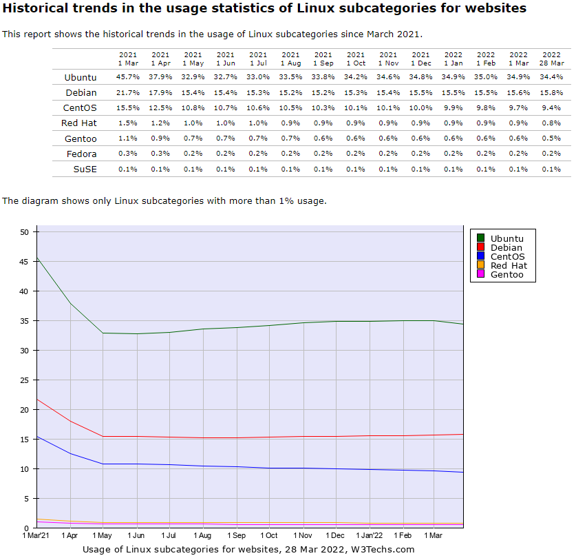

# 2. 리눅스 개요

## 2-1. 리눅스란

### 2-1-1. 리눅스의 탄생

>  1991년 8월 리눅스 토발스가 어셈블리어(Assembly Language)어를 이용하여 Kernel 버전 0.0.1을 제작한 것이 시초다. 유닉스를 기반으로 한 Minix 보다 좋은 운영체제를 제작하는 것이 목적이었다. 1992년 Kernel 버전 0.0.2 가 제작되었고 이를 인터넷에 오픈소스로 코드를 공개하면서 리눅스가 탄생하게 되었다. 그로부터 지금까지 다양한 기업들이 Kernel 을 기반으로 컴파일러(Compiler), 쉘(Shell), 기타 응용 프로그램을 포함시켜 배포판에 자신들의 이름을 붙여 배포하고 있다. 
>
> 하지만 엄밀히 말해서 리눅스는 GNU(그누) 프로젝트에 의해 완성되었기 때문에 그누프로젝트라고 부르는 것이 정확한 표현이다.

### 2-1-2. 그누(GNU) 프로젝트

> GNU 프로젝트의 목적은 근본적으로 컴퓨터 프로그램에 대한 저작권을 없애는 것으로 한다. 모두가 공유할 수 있는 소프트웨어를 제작하고 프로그램의 복제, 변경, 소스 코드의 제한을 철폐하는 것에 진정한 가치를 둔다.
>
> 자유 소프트웨어 재단(FSF : Free Sofrware Foundation)dms 리처드 스톨만(Richard Stallman)이 주최가 되어 설립된 재단이다. 재단은 GNU 프로젝트를 지원하고 모든 프로그램의 라이센스를 GPL 라이선스로 규정하여 자유 소프트웨어 개념을 도입했다. 
>
> 자유 소프트웨어란 소스 코드를 공개, 사용, 수정, 재배포의 자유, 수정한 소프트웨어의 판매 자유를 말한다.

## 2-2. 리눅스의 특징

1. 오픈소스 운영체제이다.
2. 멀티 유저(다중 사용자), 멀티 태스킹(다중 작업) 운영체제이다.
   - 멀티 유저 기능은 여러 사용자가 동시에 동일한 시스템에 접근이 가능한 것을 의미한다.
   - 멀티 태스킹은 여러 개의 태스크를 동시에 실행하고, 교대로 컴퓨터의 자원을 사용할 수 있는 기능이다.
   - 가상 터미널 환경으로 하나의 모니터에 여러 개의 가상 화면(가상 콘솔)을 두어 화면마다 다른 작업을 실행할 수 있다.
3. 다중 스레드를 지원하는 네트워크 운영체제이다.
   - 하나의 프로세스 내에서 여러 개의 네트워크 작업을 동시에 처리할 수 있기 때문에 강력한 네트워크 지원이 가능하다.
   - 네트워크 서버로 이용이 가능하며 인터넷과 이더넷에 안정적으로 연결이 가능하다.
   - 웹 브라우저, 메일, 뉴스, 웹 서버 등의 모든 인터넷 서비스 기능을 갖추고 있다.
4. 여러 종류의 파일시스템을 지원하는 운영체제이다.
   - 리눅스의 기본 파일 시스템인 ext2, ext3, ext4, DOS의 FAT, Window의 FAT3, NTFS, 네트워크 파일 시스템 SMB, CIFS, NFS 등도 지원한다.

## 2-3. 리눅스의 종류

> 리눅스 배포판은 매우 다양하다. 하지만 전부 사용되는 것은 아니며, 
> 새로운 배포판이 생성되고 사라지면서 유명한 배포판만 사용하게 된다. 
> 리눅스는 크게 Debian 계열, RedHat 계열, Slackware 계열이 있다.
> 
> 아래 그래프를 보면 리눅스의 어떤 배포판이 얼마나 사용되고 있는지 확인할 수 있다.

### 2-3-1. Debian 계열

- Debian
   - 데비안은 슬랙웨어 다음으로 오래된 배포판으로 인기가 많고 영향력 있는 배포판이다. 데비안이라는 이름은 데비안 프로젝트의 창시자인 이안 머독과 그의 부인인 데브라의 이름에서 유래했다고 한다. 유닉스에 가깝게 개발되었고, 현재는 Debian GNU/Linux만 정식 지원하며, 데비안 프로젝트라는 공동체에서 개발하고 있다.
   - 이 배포판의 특징은 설치, 업데이트가 단순하고 쉽다. 또한, 안정성과 보안에 중점을 두어 사용되고 있다. 다만 설정관련해서는 어려운 부분이 있다.
   - `apt`라는 패키지 관리자가 있는데, 이를 활용하여 프로그램을 깔고 업데이트 하며, 다른 패키지에서의 의존성 확인, 보안관련 업데이트 등을 할 수 있다.

- Ubuntu
   - 데스크탑에서 리눅스를 쉽게 사용할 수 있도록 만들어진 리눅스 배포판이다.
   - 우분투는 데비안/GNU/리눅스에 기초한 리눅스로 고유의 데스크탑 환경인 유니티를 사용한다. 영국에 기반을 둔 캐노니컬이라는 회사의 지원을 받으며 6개월에 한번씩 새판이 나온다.
   - 사용자 편의성에 많은 초점을 두고 있다. 가장 인기있는 리눅스 배포판이다.
   - 데비안 계열의 `apt` 관리도구, 유지보수, 범용성, 웹서버나 PC로 사용하기에 무난하다.
   - 리눅스 입문용으로 적합하며 수많은 정보가 웹에 공개되어 있다.
   - 우분투는 일반 버전과 LTS(Long Term Support) 버전이 있다. 
   - LTS 버전은 각종 버그, 크래시 수정이나 보안성 등의 업데이트가 5년간 지원이 된다. 반면에 일반 버전은 우분투의 새로운 기능들을 접하는 대신 기술지원은 9개월로 매우 짧다.
   
- Linux Mint
   - PC를 위한 배포판으로 우분투에서 파생되었지만 부트로더를 간단히 만들고 데스크탑의 레이아웃, 테마 등을 차별화했다.
   - 무선 네트워크 드라이버를 포함했고 동영상 코덱을 갖춰 일반적인 동영상을 바로 재생한다. 
   - 민트 툴을 이용해 쉽게 시스템을 관리할 수 있다.
   
### 2-3-2. RedHat 계열

- Fedora
   - 레드햇에서 후원하는 페도라 프로젝트에서 개발한 RPM 기반의 리눅스 배포판이며 개인이나 기업 등 다양한 환경에서 사용될 수 있도록 만들어졌다.
   - 그래픽 기반의 아나콘다 인스톨러와 시스템-환경설정 도구로 누구나 쉽게 OS를 설치할 수 있게 만들었다.
   - 6개월 간격으로 새로운 버전이 배포되어 상대적으로 짧은 교환주기를 갖고, 버전마다 13개월씩만 지원한다.
   > RPM : Redhat Package Manager 의 약자로 레드햇이 개발한 패키지와 배포 관리 시스템
  
- CentOS
   - 업스트림 소스인 레드햇 엔터프라이즈 리눅스와 완벽하게 호환되는 무료 기업용 컴퓨팅 플랫폼을 제공하기 위해 만들어진 리눅스
   - 레드햇 엔터프라이즈 리눅스의 소스코드를 그대로 빌드하고 레드햇 상표대신 CentOS라는 상표가 붙기만 한 리눅스이다. 레드헷의 기술을 그대로 사용할 수 있다.
   
### 2-3-3. Slackware 계열

- openSUSE
   - 수세 리눅스(SUSE Linux)는 2004년 노벨에 인수되었고, 노벨은 수세 리눅스 프로페셔널을 오픈소스로 발표하면서 나온 결과가 오픈 수세이다.
   - 수세 리눅스는 슬랙웨어 리눅스를 기반으로하여 독일에서 만들어졌다.
    