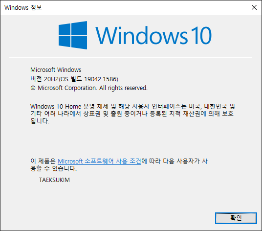

# 3. 버추얼 박스 설치 및 세팅

## 3-1. 윈도우(Windows)에 버추얼 박스 설치

### 3-1-1. 내 운영체제 확인하기

- 버추얼박스를 설치하기 전에 자신이 사용중인 Window가 어떤 버전인지 몇비트인지 확인한다.
> 윈도우 검색창이나 "window + s" 를 입력한 상태에서 winver를 실행하면 자신의 윈도우 버전을 확인할 수 있다.
>
> 내 PC 오른쪽 클릭 > 속성 창을 열어 운영체제 비트 수도 확인한다. 

### 3-1-2. VM VirtualBox 설치하기

- VM VirtualBox를 설치한다.
> VirtualBox는 본래 이노테크(InnoTek)가 개발했지만, 현재는 오라클에서 개발 중인 상용 소프트웨어이다.
> 이 소프트웨어를 이용하여 리눅스, macOS, 윈도우 등을 게스트 운영 체제로 가상화 할수 있다.
 
- https://www.virtualbox.org/ 에서 윈도우 용으로 다운을 진행한다.

- 다운받은 설치 프로그램을 실행하여 설치를 진행한다. 기본적인 설정은 그대로 두고 진행한다.

> 기본적으로 가상 머신을 설치하는 경우, 네트워크 인터페이스 또한 설정하는 경우가 많기 때문에 설치 과정 중에 일시적으로 인터넷 연결이 끊길수 있다.

- 설치 완료후 실행한 화면

## 3-2. 우분투 설치 세팅

### 3-2-1. 우분투 다운로드

- 우분투 공식 사이트에 방문하여 우분투 iso 파일을 다운 받는다. (http://releases.ubuntu.com/)

> LTS 버전은 각종 버그, 크래시 수정이나 보안성 등의 업데이트가 5년간 지원이 된다. 

### 3-2-2. 가상머신 세팅

- VM VirtualBox 에서 새로 만들기를 클릭하여 새롭게 가상머신을 생성한다.

- 가상머신 이름은 알아보기 쉬운 이름으로 정한다.
  

- 가상머신이 돌아갈 때에 사용할 메모리 크기를 지정해야 한다. 자신의 PC의 상황에 따라 적절하게 할당한다.
> 메모리를 너무 과도하게 하거나 너무 적게 하면 가상 머신이 갑자기 종료되거나 기타 문제가 발생할 수 있다.

- 가상머신이 사용할 데이터 저장 목정의 하드 디스크를 추가할 수 있다. 일반적으로 새로운 가상 하드 디스크를 만들어 사용한다.

- 기본적으론 하드디스크 파일 종류인 VDI(VitualBox Disk Image)를 선택해서 만든다.
> VDI(Vurtual Disk Image) 
> 
> VDI 파일은 Oracle 버추얼박스에서만 사용가능한 포멧 방식이다.
> 버추얼박스에서 VM(Virtual Machine) 생성시에 하드디스크 타입을 VDI로 선택했다면 다른 PC에 복사/이동해서 사용할 때에도 버추얼 박스가 설치되어 있어야만 사용 가능
> 
> VHD(Virtual Hard Disk)
> 
> VHD 파일은 Oracle 버추얼박스, 마이크로소프트의 Hyper-V, 시트릭스의 Xen에서 구동이 가능한 포멧 방식이다.
> VDI와 마찬가지로 VHD 파일은 다른 PC로 복사/이동시켜 사용하려면 해당 PC에 위 프로그램이 설치되어 있어야 불러와 사용 가능
> 
> VMDK(Virtual Machine Disk) 
> 
> VMDK 파일은 Oracle의 버추얼박스, VMware의 VMware Player에서 구동이 가능한 포멧 방식이다.
> 복사/이동하여 사용하려면 해당 프로그램들이 있어야 가능하다.

- 용량의 경우 고정 크기로 선택하여 만든다.

- 가상머신 하드디스크 크기는 컴퓨터 용량에 맞게 설정한다.

- 이제 우분투가 설치될 모든 환경 세팅이 완료되었다.

- 설정을 누른뒤 "저장소 > 컨트롤러 : IDE 의 비어있음 클릭 > 디스크 모양 클릭 > 가상 광학디스크 선택"

- 아까 다운 받은 ISO 파일을 선택해서 추가한다.

  

- 정상적으로 선택된 것을 볼 수 있다.  

- [시작]을 누르면, 우분투 ISO 파일을 이용하여 우분투로 부팅이 진행된다.

  