# 4. 우분투 설치

## 4-1. 가상머신에 우분투 설치하기

### 4-1-1. 우분투 설치

- [시작] 을 눌러 우분투로 가상 머신을 부팅한다.

> 지금까진 우분투를 설치하기 위한 환경세팅을 한 것이다. 이제부터 우분투를 설치해보도록 하자.

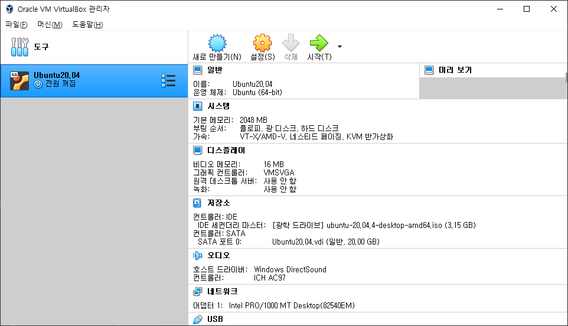

- 우분투를 시작하기 전에 세팅할 것이 하나 있다.
> 버추얼 박스에는 기본적으로 마우스 잡기 기능이 있어서 버추얼 박스 내에서 작업을 하게 되면 윈도우로 마우스를 꺼낼수가 없다.
> 빠져나가기 위해서는 Crtl + Alt + Del 을 눌러서 나오는 방법이 있지만, 불편하기 때문에 특정 키를 누르면
> 빠져나올수 있도록 세팅하자.
>
> 우분투 시작 후 좌측 상단에 메뉴바에서 "파일 > 환경설정 > 입력" 으로 이동하여 `호스트 키 조합` 이라는 부분의 단축키를 자신이 원하는 키로 변경한다.

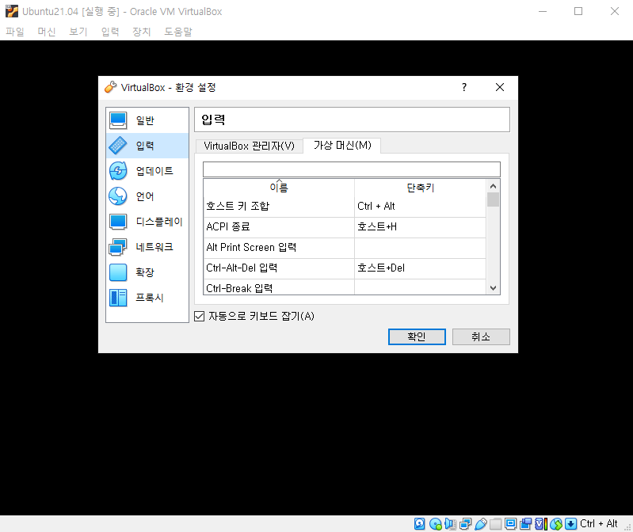

- 우분투 설치파일이 기동된 이후에는 "Install Ubuntu(Ubuntu 설치)" 를 클릭하여 설치를 진행한다.
> 이 단계에서 한국어로 설치를 진행하면 "Continue" 버튼이 보이지 않는 버그가 있어 진행이 안된다.

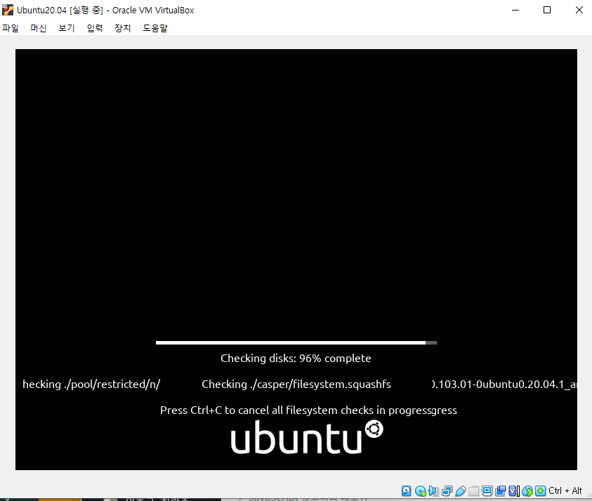

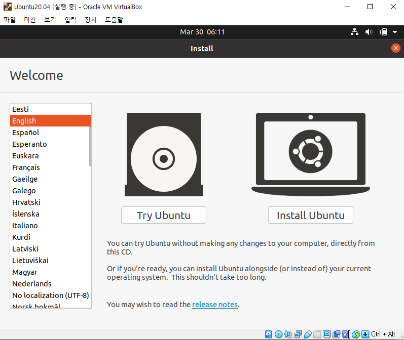

- 키보드 레이아웃은 Korean 101/104키 호환으로 선택하여 진행한다.
> 이후에 한글 설정은 다시 할 예정이기 때문에 어느 것을 골라도 크게 상관 없다.

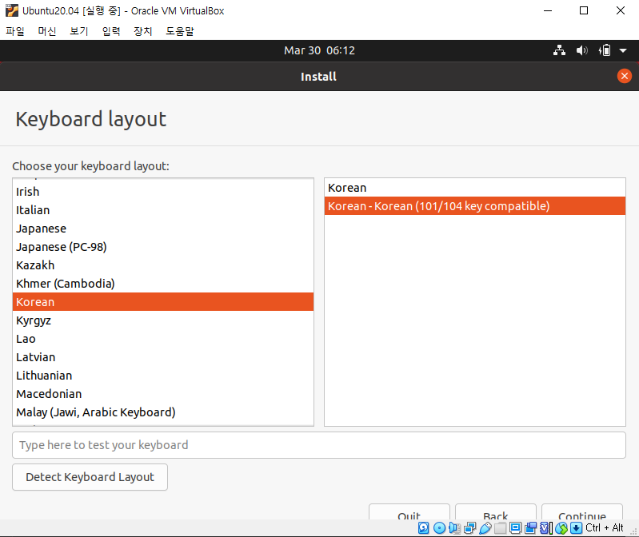

- 기본으로 설치를 진행한다.

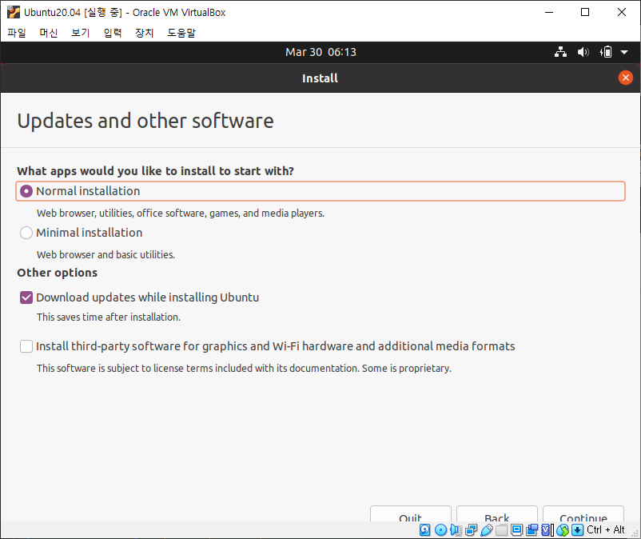

- 우분투 OS를 설치할 때는 기본적으로 디스크를 비운 뒤 설치하는 것이 좋다. 여기서 말하는 디스크는 가상머신의 디스크이다. 지우고 설치하는 것으로 진행한다.
> 혹시 파티션을 수동으로 나누고 싶다면 Something else로 진행한다.

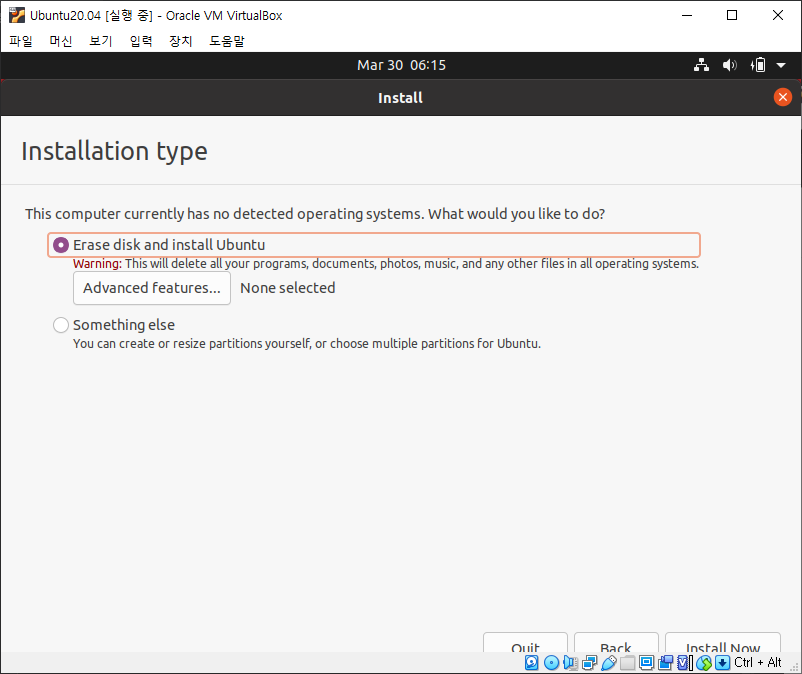

- 파티션에 대한 다시한번 확인하는 메시지이다. 전문가용으로 Linux 설치 하는게 아니므로 기본설정으로 진행한다.

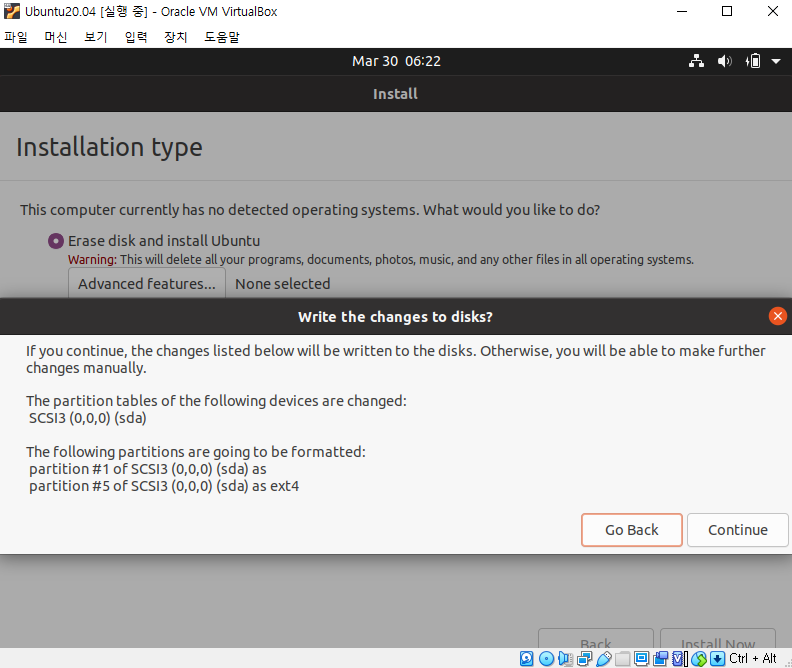

- 기본적인 날짜 설정을 위해 위치를 확인한다. 서울(Seoul)을 선택하여 진행한다.

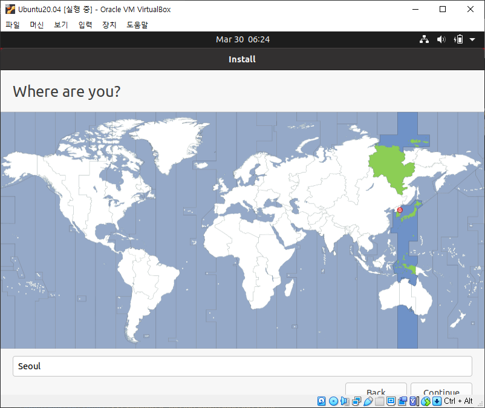

- 컴퓨터 이름 및 기본 계정 설정을 진행한다.
> - Your name : 이름(또는 계정)
> - Your computer's name : 컴퓨터 이름
> - Pick a username : 사용자 이름
> - ... Password : 암호

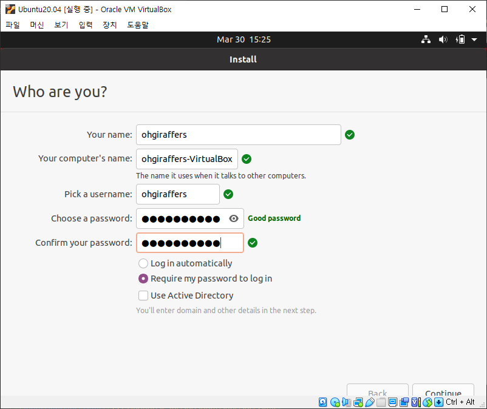

- 설치가 진행된다.

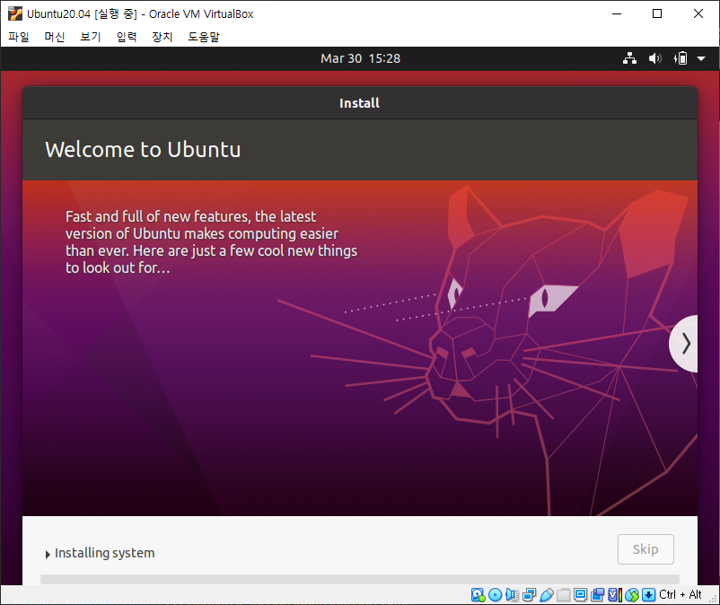

- 설치가 완료되면 재시작한다.

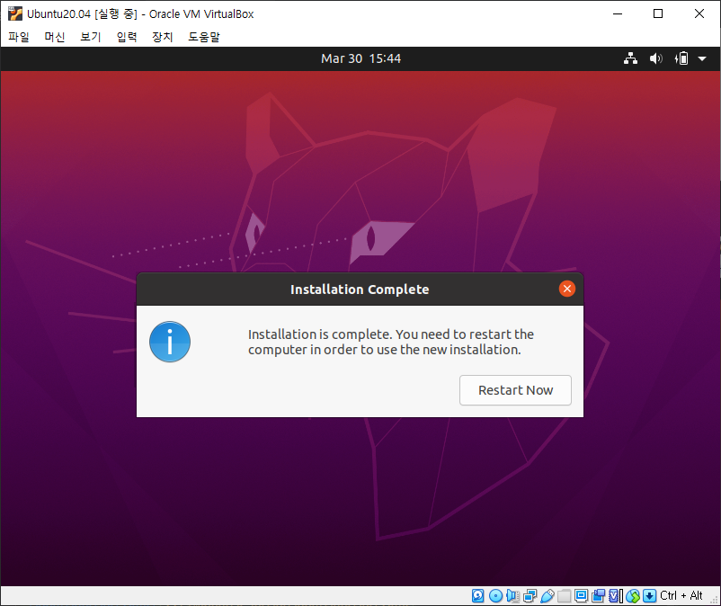

- 재시작을 하면 도스창에서 알림이 뜨는데 "Enter" 를 누르면 된다.

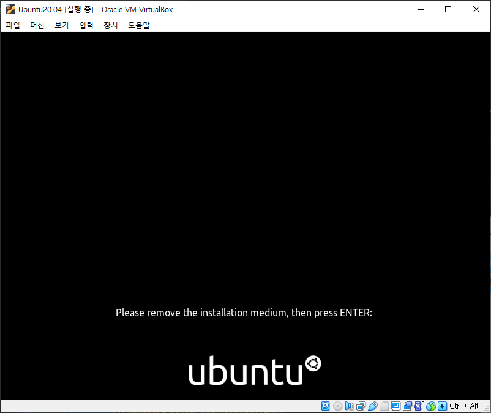

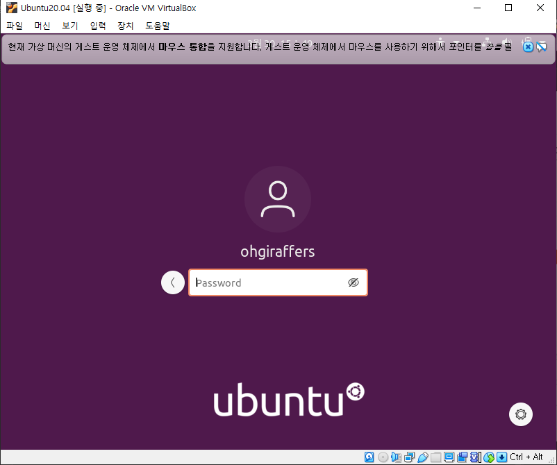