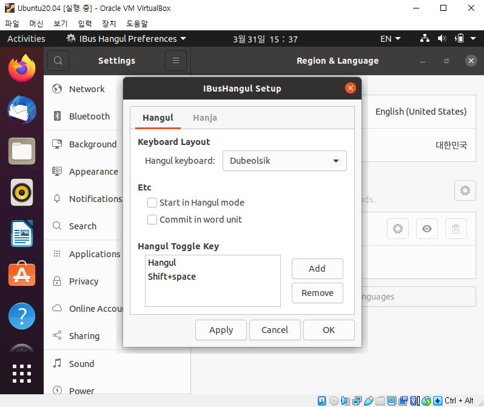

# 5. 우분투 한글 세팅

## 5-1. 우분투 한글 세팅하기

### 5-1-1. 우분투 기본 업데이트

- 우분투 시작하면 업데이트 하라고 뜨게 되는데 진행한다.(30분~1시간정도 소요예상)
> 바로 뜨지 않을 경우 조금만 기다리면 업데이트 창이 뜬다.
> 

### 5-1-2. 우분투 한글 세팅 준비

- 한글 키보드 입력 설정을 위해 Settings 을 열고 Region & Language 탭으로 이동 후 
Manage Installed Languages 클릭
> 보통 한글 입력 때문에 키보드 설정을 미리 하는 것이 편하다. 

- 만약 업데이트 하라고 뜨면 진행한다.
> 업데이트 한 이후에 재부팅을 하는 것을 추천한다. 업데이트를 안하면 이후에 작업시 진행이 어려울 수 있다.

- Language Support 창에서 Install / Remove Languages..를 눌러 Korean이 체크 되어 있는지 확인후 안되어 있으면 체크하고 Apply를 누른다.

- 언어 지원리스트에 한국어가 있는지 확인한다.

### 5-1-3. 우분투 한글 추가

- 터미널을 열어 다음의 명령어를 입력한다. (Activities를 누르고 terminal을 검색하면 터미널을 열수 있다.)

- IBUS Preference 에서 Input Method 탭에서 Add를 눌러 Korean-Hangul을 추가한다.

> Add를 누르면 하단에 ... 부분이 있다. 이 부분을 누른 후 korean을 검색한 뒤 클릭하면 아래와 같은 Hangul이 보인다.
> 만약 보이지 않는다면 Ubuntu를 재부팅 한다.

- Setting > Region & Language 탭으로 돌아와서 Input Sources 부분의 +를 누른다.

- ...(More) 를 누른 후 Korean을 검색후 클릭하면 다음과 같은 창이 보이고 Korean(Hangul) 을 추가한다.
그리고 기존에 있던 Korean은 휴지통 버튼을 눌러 삭제한다.

### 5-1-3. 우분투 한/영 토글키 추가

- 추가된 Korean(Hangul)에 톱니바퀴를 누르면 한/영 을 변환할 수 있는 키설정을 할 수 있다. Add를 눌르면 팝업창이 뜨는데 이 때 한/영 키로 사용하고 싶은 키를 입력한다.

- 한/영 키 Toggle로 사용할 Key 목록이 3개가 되었다. OK를 눌러 저장한다.

- 한글입력이 잘되는지 확인한다.

