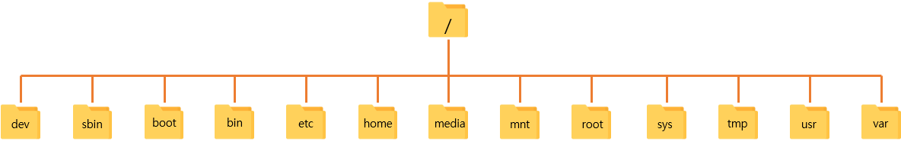
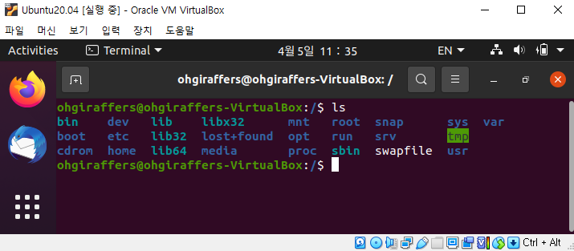
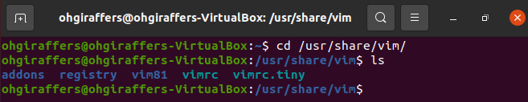

# 6. 파일시스템

## 6-1. 파일시스템 개요

### 6-1-1. 파일시스템(File System) 이란?
> 파일 시스템은 파일에 이름을 붙이고 저장, 탐색을 위해 파일을 어디에 위치 시킬 것인지 나타내는 체계이다.
> 즉, 컴퓨터에서 자료들을 쉽게 발견하고 관리할수 있게 하는 구조적인 시스템을 말한다.
> 
> 사용자 영역이 아닌 커널 영역에서 동작한다. 파일을 빠르게 읽기, 쓰기, 삭제 등 기본적인 기능을 원활히 수행하기 위한 목적이다.
> 이는 리눅스 뿐만 아니라 거의 모든 OS(Oprating System)가 지원하고 있다.

### 6-1-2. 파일 시스템의 특징
1. 계층적 디렉터리 구조를 가진다.
2. 디스크 파티션 별로 파일구조를 하나씩 둘 수 있다.

### 6-1-3. 파일 시스템의 역할
1. 파일관리 - 파일 저장, 참조, 공유
2. 보조 저장소 관리 - 저장공간 할당
3. 파일 무결성 메커니즘 - 파일이 의도한 정보만 포함하고 있음을 의미
4. 접근 방법 - 저장된 데이터에 접근할 수 있는 방법 제공

### 6-1-4. 파일 시스템 개발 목적
1. 보조 기억장치와 메인 메모리 속도차이 줄이기
2. 파일 관리 용이성 증대
3. 보조 기억장치의 막대한 용량을 효율적 향상

### 6-1-5. 주요 파일 시스템
- Windows - FAT(FAT16/32 등), NTFS
- Linux - ext(ext2/3/4)
- Max OS - HFS, HFS+

### 6-1-6. 파일 시스템 구조
1. 메타 영역과 데이터 영역 두가지 영역으로 구분이 된다.
2. 메타 영역은 데이터 영역에 기록된 파일의 이름, 위치, 크기, 시간정보, 삭제유무 등 파일의 정보이다.
3. 데이터 영역은 파일의 실제 데이터이다.

## 6-2. 리눅스 파일시스템과 구조

> 리눅스는 윈도우와 달리 Ext(Extended File System)을 사용합니다.
> ext 부터 발전되어 현재는 ext4 를 주로 사용하고 있습니다.

| 파일 시스템   | 설명                                                         |
| ------ | ------------------------------------------------------------ |
| EXT    | 리눅스 초기에 사용되던 시스템   호환성 없음   EXT2의 원형  2GB의 데이터와 파일명 255자까지 지원 
| EXT2   | 고용량 디스크 사용을 염두하고 설계된 파일 시스템   호환과 업그레이드가 쉬움  4TB 파일 크기까지 지원 |
| EXT3   | 리눅스의 대표적인 저널링을 지원하도록 확장된 파일 시스템 ACL (Access Control List)를 통한 접근 제어 지원 16TB의 파일 크기까지 지원 |
| EXT4   | 파일에 디스크 할당 시 물리적으로 연속적인 블록을 할당 64비트 기억 공간 제한을 없앰 16TB 파일 크기까지 지원 |

> 저널링
> 
> 시스템의 비정상적인 종료 시에도 로그에 저장된 데이터만을 사용한 검사로써 빠른 속도와 무결성, 안정적인 복구기능을 제공하는 파일시스템 기술이다.
> 이것이 가능한 이유는 복구시간을 단축하기 위해 파일 혹은 데이터를 실제로 디스크에 쓰는 생성 및 수정과정 전에 우선 로그에 수정하고자 하는 데이터를 남긴후 해당 내용을 저장하기 때문이다.

### 6-2-1. 리눅스 파일 구조

- /
  - 리눅스 파일 체제의 최상의 디렉토리
  - 모든 디렉토리들의 시작점으로 일반적인 데이터를 저장하지 않는다.
    
- dev
    - 시스템 디바이스(device) 파일을 저장하고 있는 디렉토리
    - 하드 디스크 장치파일 /dev/sda, CD-ROM 장치파일 /dev/cdrom 등과 같은 장치파일들이 존재하는 곳이다.

- sbin
  - bin 디렉토리와 유사하지만 오직 루트유저만 실행할 수 있는 프로그램들이 있는 디렉토리
  - ifconfig, e2fsck, ethtool, halt 와 같이 주로 시스템 관리자들이 사용하는 시스템 관리자용 명령어를 저장하고 있다.
    
- boot
    - 부팅에 핵심적인 커널 이미지와 부팅 정보 파일을 담고 있는 디렉토리
    - GRUB 과 같은 부트로더에 관한 파일들(grub.conf 등)이 이 디렉토리에 존재한다.
    
- bin
    - 리눅스의 기본 명령어(binary) 들이 들어있는 디렉토리
    - 시스템을 운영하기 위한 기본적인 명령어들이 모여있다.(mv, cp, rm 등)
    - root 사용자와 일반 사용자가 함께 사용할 수있는 명령어 디렉토리
    
- etc
    - 시스템 환경 설정 파일이 있는 디렉토리
    - 네트워크 관련 설정 파일, 사용자 정보 및 암호정보, 파일 시스템 정보, 보안 파일 등이 있다.
    
- home
    - 리눅스 사용자의 홈 디렉토리(사용자 계정명과 동일)가 만들어지는 디렉토리
    
- media
    - CD-ROM이나 USB 같은 탈부착이 가능한 장치들의 마운트포인트로 사용되는 디렉토리
    
- mnt
    - media 디렉토리와 비슷한 용도로 탈부착이 가능한 장치들에 대하여 일시적인 마운트포인트로 사용되는 디렉토리
    
- root
    - 시스템 관리자의 홈 디렉토리
    - 일반 사용자가 접근하지 못한다.
  
- sys
  - 리눅스 커널관련 정보가 있는 디렉토리
  
- tmp
  - 일명 "공용 디렉토리"이며 시스템을 사용하는 모든 사용자들이 공동으로 사용하는 디렉토리
  - mysql에서 사용하는 mysql.sock 등과 같은 소켓파일, 또는 아파치에서 사용하는 세션파일등이 생성되고 한다. 
  
- usr
  - 기본 실행파일과 라이브러리 파일, 헤더 파일등의 파일이 저장되어 있는 디렉토리
  - 대부분의 응용프로그램과 파일이 저장되어 있다.
  
- var 
  - 시스템 운용중에 생성되었다가 삭제되는 데이터를 일시적으로 저장하기 위한 디렉토리.
  - 거의 모든 시스템 로그파일은 /var/log에 저장되고, DNS의 zone 설정파일은 /var/named에 저장되고, 메일파일은 /var/spool/mail에 저장되며, 크론 설정파일은 /var/spool/cron 디렉토리에 각각 저장된다.

- 실제 우분투가 설치된 후 /(root) 경로 밑에 존재하는 파일들 

- 폴더 매칭 간단 정리

| 기능 | Windows | Linux |
| :---: | --------| ------|
| root | C:\ | / |
| 사용자폴더 | C:\Users\\{username} | /home/{username} |
| 설정 | 폴더는 숨겨져 있지만 제어판으로 접근 | /etc |
| 시스템파일 | C:\Windows\ | /bin, /sbin, /lib |
| 설치 프로그램 | C:\Profram Files | /usr |
| CD-ROM | D:\ (또는 E,F, 등) | /media/cdrom (또는 /mnt/cdrom, /cdrom) |

- vim 설치시 설치된 위치

