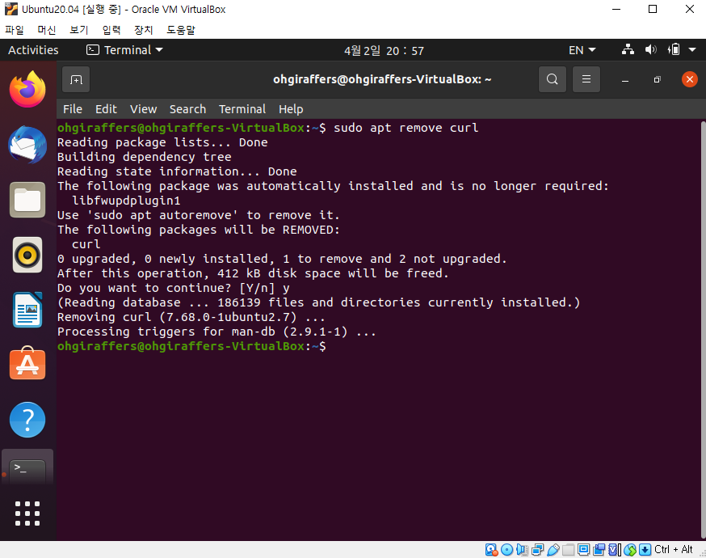

# 6. 우분투 개발 환경 세팅

## 6-1. apt 

### 6-1-1. apt 란?
> 우분투에서는 패키지를 관리하는 툴로 apt-get 과 apt-cache를 주로 사용해왔다. 요즘엔 두 명령어를 통합하여 apt로 사용한다.
> apt는 apt-get/apt-cache 를 완전히 통합하는 툴은 아니다. 사용자 편의성을 위해 주요기능만 통합한 툴이다.
> 
> 하지만, 전문가가 아니라면 apt로도 충분하다.
> - 패키지 저장소 리스트 : /etc/apt/sources.list
> 
> apt와 apt 패키지 저장소 리스트 때문에 일일히 홈페이지 검색하여 다운 받을 필요가 없지만, 모든 프로그래밍 우분투 공식 저장소에 들어갈 수 없다.
> 따라서 PPA(Personal Package Archive) 라는 개인 패키지 저장소를 이용해야 하는 경우가 생길수 있다.
> 저장한 PPA 목록은 /etc/apt/sources.list.d 에서 확인할 수 있다.

### 7-1-2. apt install
> 패키지 설치 하는 명령어이다. 패키지 명을 여러개 지정해서 한번에 설치도 가능하다. 이때 패키지명 사이사이는 공백으로 띄어주어야 한다.
>
> - apt install <package_name> [<package_name> ...]
> 
> apt 명령어를 이용해 설치한 패키지는 /var/cache/apt/archives에 설치된다.

### 7-1-3. apt remove
> 패키지 제거하는 명령이다. remove 명령은 저장한 패키지만을 제거한다. 설정 파일은 자동으로 삭제되지 않는다.
> 
> - apt remove <package_name>

### 7-1-4. apt purge
> 패키지와 설정파일까지 제거 하는 명령어이다. purge 명령은 remove와 달리 패키지와 설정 파일 모두 제거하는 명령어다.
> 
> - apt purge <package_name>

### 7-1-5. apt autoremove
> 사용하지 않는 패키지 제거하는 명령어이다. 해당 명령을 사용하면 현재 사용되지 않는 패키지를 제거한다.
> 
> - apt autoremove

### 7-1-6. apt search 
> 패키지 검색할 수 있는 명령어이다. apt 툴을 이용하여 설치할 수 있는 패키지 검색 명령이다.
> 
> - apt search <key word>

### 7-1-7. apt list
> 패키지 목록 조회하는 명령어이다. apt list는 레파지토리에 등록된 패키지 목록을 조회하는 명령어다.
> 
> - apt list

### 7-1-8. apt update
> 현재 사용 가능한 패키지 리스트를 업데이트 해주는 명령어이다. 
> 
> - apt update
> 
> apt update 명령은 우분투의 /etc/apt/sources.list 파일이나 /etc/apt/sources.list.d 디렉터리에 별도로
> 구성된 파일에 구성되어 활성화된 소스들의 최신 패키지 정보를 다운로드 하는데 사용한다.

- 업데이트 완료되면 아래와 같이 Done 이라고 출력된다.

## 7-2. 클립보드 설정

> 윈도우와 버추얼박스에서 돌아가는 OS 는 원래는 클립보드를 공유할 수 없다.
> 하지만 이대로 사용하면 너무 불편하기 때문에 확장프로그램을 이용하여 공유를 할수 있도록 한다.
> 해당 설치를 진행하면 화면도 크기 조절 가능하다.

- 버추얼 박스창에서 장치 > 게스트 확장 CD 이미지 삽입 을 진행한다.

- Run을 눌러 설치를 진행한다.

  

- 장치 > 클립보드 공유 > 양방향으로 설정한후 리눅스를 재부팅한다.

## 7-3. Vim 편집기 설치

- vim 설치를 진행해본다. 아래 명령어를 입력한다. 중간에 y/n입력하는 곳에서는 y로 설치를 진행한다. vim 문법은 후에 따로 소개할 예정이다.

> sudo apt install vim

- vim 설치 완료후 몇가지 설정을 진행한다. 설정을 위해 아래 처럼 명령어를 입력한다.

> vi ~/.vimrc

> 입력모드는 i 키를 누르면 된다. 아래 설정을 다 복사해서 붙여넣는다.(붙여넣기 shift + Insert)
> 입력을 다 하면 입력모드를 끝낸후(esc) :wq 를 입력하여 저장하고 나온다.
> 
> " 표시 뒤에 쓰면 주석 처리 된다.
> 
> " Syntax Highlighting  
> if has("syntax")  
> syntax on  
> endif  
>
> " 검색 관련 설정  
> set ignorecase  "검색시 대소문자 무시  
> set hlsearch  "검색 단어 하이라이트  
>
> " 에디터 관련 설정  
> set number  "Line Number 표시  
> set cindent   "자동 들여쓰기  
> set autoindent  
> set ts=2  "Tab 너비(보여줄 때)  
> set sts=2 "Tab 너비(작성할 때)  
> set shiftwidth=4 "자동 인덴트 너비  
> set showmatch   "짝이 되는 괄호 하이라이트  

