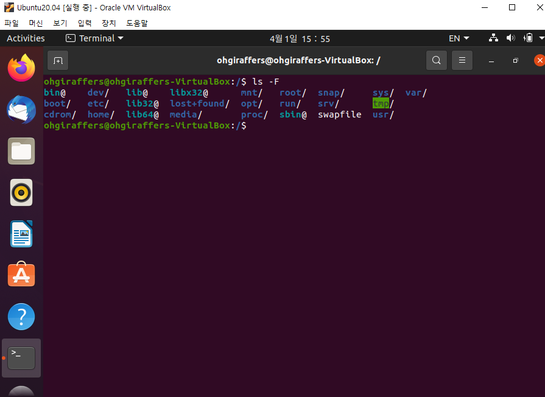

# 8. 우분투 기본 명령어

## 8-1. 디렉터리 관련 명령어

### 8-1-1. pwd(print working directory)
> 현재 디렉터리 경로 확인 하는 명령어. 절대경로명을 출력한다.

### 8-1-2. ls(List Segments)

> 현재 위치의 파일 목록을 조회하는 명령어
> 
> ls [OPTIONS] [디렉터리]
>
> - ls / : root에 있는 파일 목록 출력
> - ls /ohgiraffers : /ohgiraffers 경로의 디렉터리에 있는 파일 출력

| 옵션 | 설명 |
| :---: | --- |
| -l | 파일들의 상세 정보를 나타낸다.(각 파일의 모드, 링크수, 소유자, 그룹, 크기, 최종 수정시간) |
| -a | 숨김 파일들을 표시한다.(숨김 파일이나 폴더 이름 앞에는 .이 붙어있다.) |
| -d | 지정 경로에 있는 최상위 디렉토리의 목록만 출력한다.|
| -r | 역순으로 보여진다. |
| -m | 쉼표로 구분해서 보여준다.|
| -F | 파일이 디렉터리인 경우 /, 파일이 실행 가능한 경우 *, 소켓인 경우 =, 선입선출인 경우 파이프라인, 링크인 경우 @를 각각 파일 이름 뒤에 표기 |
| -t | 최종 수정 시간 기준 |
| -u | -lt와 같이 사용시 생성 시간 기준으로 출력하고 -l과 사용시 생성시간 출력이름순으로 출력한다. |
| -A | .와 ..을 제외하고 목록을 출력한다.|
| -b | 알파벳 순으로 목록을 출력한다.|
| -B | ~로 끝나는 백업파일을 제외하고 목록을 출력한다.|
| -c | 마지막으로 변경된 시간을 목록을 출력한다.|
| -C | 파일이나 디렉토리를 열로 목록을 출력한다.|
| -D | emacs를 위한 출력행태를 생성한다.|
| -f | 정렬하지 않고 출력합니다. 컬러을 해제한다.|
| -g | 사용자 권한을 출력하지 않는다.|
| -G | -l 과 같이 사용시 그룹권한을 출력하지 않는다.|
| -h | K, M, G 단위를 사용하여 파일 크기를 사람이 보기 좋게 표시한다.|
| -H | 심볼릭 링크의 실제 참조하는 목록을 출력한다.|
| -i | 파일의 인덱스 값을 출력한다.|
| -I (대문자 i) | 지정 파티션을 제외하고 출력한다.|
| -k | 용량을 킬로바이트로 출력한다.|
| -lu | mtime (수정 시간)을 atime(접근 시간)을 출력한다. (default는 수정 시간)|
| -lc | mtime (수정 시간)을  ctime(변경 시간)을 출력한다. (default는 수정 시간)|
| -L | 심볼릭 링크의 정보를 출력할때 원본 파일의 정보를 출력한다.|
| -n | 사용자와 그룹권한을 숫자로 표시한다.|
| -i | 그룹권한을 출력하지 않는다.|
| -p | 디렉토리에 /를 추가한다.|
| -R | 하위 디렉토리까지 출력한다.|
| -s | 블록에 할당된 크기를 출력한다.|
| -S | 파일 크기 순으로 정렬하여 출력한다.|
| -U | 컬러을 유지하면서 정렬하지 않고 출력한다.|
| -w | width 길이를 설정하여 출력한다.|

- 옵션은 조합도 가능하다. 주로 ls -al을 많이 사용한다.

- ls -F 실행 결과

### 8-1-3. cd(Change Directory)

> 경로 이동할 때 사용하는 명령어
> 
> cd [이동할 디렉터리 경로]
> - cd .. : 상위 디렉터리로 이동
> - cd ~  : 홈 디렉터리로 이동(계정마다 홈디렉터리가 존재하며 보통 계정명이 홈 디렉터리명이 된다)
> - cd {name} : 현재 경로 기준 {name} 디렉터리로 이동(현재 폴더 이하에 있는 곳으로만 이동 가능) 
> - cd /{path} : 절대경로 /(root 폴더) 위치 기준으로 {path} 로 이동

- 상위 디렉터리로 이동
  

- 홈 디렉터리로 이동
  

- 현재 디렉터리 이하로 이동

- 절대 경로로 디렉터리 이동

### 8-1-4. mkdir(Make Directory)
> 새로운 디렉터리 생성하는 명령어
> 
> mkdir [OPTIONS] [생성할 디렉터리]
>
> - mkdir {name} : {name}의 디렉터리를 현재 위치에 생성한다.(경로 지정해서 생성도 가능)
> - mkdir -p {path}/{name} : 상위 디렉터리를 생성 안하고도 한번에 생성 가능(path 디렉터리 생성후 name 디렉터리 생성)
> - mkdir {name1} {name2} : 한번에 여러개의 디렉터리 생성도 가능
> - mkdir -m 700 {name} : 디렉터리 만들때 권한 부여도 가능

| 옵션 | 설명 |
| :---: | --- |
| -m | 디렉토리를 생성할 때 권한을 설정합니다. (defualt : 755)|
| -p | 상위 경로도 함께 생성합니다.|
| -v | 디렉토리를 생성하고 생성된 디렉토리에 대한 메시지를 출력합니다.|

- 디렉터리 하나 생성

- 한번에 하위 디렉터리까지 생성

### 8-1-5. rm(Remove)
> 파일이나 디렉터리를 삭제하는 명령어이다.
> 
> rm [OPTIONS] [삭제할 디렉터리/파일]
> 
> - rm {name} : {name} 을 삭제한다.
> - rm {path}/{name} : {path} 경로에 있는 {name} 파일을 삭제한다.
> - rm *.txt : .txt 로 끝나는 파일 모두 삭제한다.
> - rm -r {name} : {name} 이라는 이름의 파일/디렉터리를 삭제한다.
> - rm -rf {path} : {path} 이하에 있는 모든 파일/디렉터리가 삭제된다.(매우 위험하니 조심할 것)
> - rm -ri {path} : 삭제되는 파일/디렉터리마다 삭제할 것이냐는 확인한다. y 또는 n 을 일일히 입력해야 한다.

| 옵션 | 설명 |
| :---: | --- |
| -f | 강제로 파일이나 디렉토리를 삭제하고 대상이 없는 경우에는 메시지를 출력하지 않는다.|
| -r | 디렉토리 내부의 모든 내용을 삭제한다.|
| -d | 비어있는 디렉토리들만 제거한다.|
| -i | 매번 삭제할때마다 사용자에게 삭제할것인지 묻는다.|
| -l | 3개의 이상의 파일을 삭제하거나 디렉토리 내부가 비어있지 않을때만 삭제할것인지 묻는다.|
| -v | 삭제되는 대상의 정보를 출력한다.|

- 파일 하나 삭제

- 현재 폴더의 txt 파일 모두 삭제

- 현재 폴더 이하의 파일과 디렉터리 모두 삭제

## 8-2. 파일 관련 명령어

### 8-2-1. touch
> 파일을 생성할 때 사용하는 명령어이다. 해당 명령어를 실행시 파일이 만들어지나 내용은 비어있는 상태
> 블록지정된 곳이 용량을 표시해주는 곳인데 0으로 되어있는 것을 볼수 있다. 파일을 수정하기 위해서는 vim을 이용하는 것이 좋다.

### 8-2-2. mv(move)
> 파일이나 디렉토리를 이동 시킬 때 사용하는 명령어이다. 해당 명령어로 파일의 이름도 변경할 수 있다.
> 해당 명령어 사용시 경로를 지정하지 않으면 현 위치를 Default로 한다.
> 
> mv [OPTIONS] [이동할 파일] [이동될 위치]

| 옵션 | 설명 |
| :---: | --- |
| -b | 이동될 파일이 존재하면 백업파일을 만든다.|
| -i | 이동될 파일이 이름이 이미 존재할 경우, 사용자에게 덮어 쓰기 여부를 확인한다.|
| -b | 이동될 파일이 이름이 이미 존재할 경우, 백업파일을 생성한다.|
| -f | 이동될 파일이 이름이 이미 존재 할 경우, 강제로 덮어쓰기 한다.|
| -n | 이동될 파일이 이름이 이미 존재 할 경우, 덮어쓰기를 하지 않는다.|
| -v | 이동 진행 상태를 출력한다.|

- 파일을 현재 디렉터리 내부 디렉터리로 이동

  
- 파일 이름 변경하기

- 특정 디렉터리에 있는 파일을 현재 디렉터리로 이름 변경해서 이동하기
> ~/ 은 홈디렉터리부터 상대경로, ./ 는 현재 디렉터리 라는 의미이다. 

### 8-2-3. cp(Copy)
> 파일이나 디렉터리를 복사할 때 사용하는 명령어이다. 복사할 때 새로운 이름을 지정해 복사할 수 있다.
> 
> cp [OPTIONS] [복사할 디렉터리/파일] [복사될 디렉터리/파일]

| 옵션 | 설명 |
| :---: | --- |
| -i | 복사될 파일이 이름이 이미 존재할 경우, 사용자에게 덮어 쓰기 여부를 묻는다.|
| -b | 복사될 파일이 이름이 이미 존재할 경우, 백업파일을 생성한다.|
| -f | 복사 될 파일이 이름이 이미 존재 할 경우, 강제로 덮어쓰기 한다.|
| -r | 하위 디렉토리 까지 모두 복사한다.|
| -a | 원본 파일의 속성, 링크 정보까지 모두 복사한다.|
| -p | 원본 파일의 소유자, 그룹, 권한 등의 정보까지 모두 복사한다.|
| -v | 복사 진행 상태를 출력한다.|

- 파일 하나 복사, 여러 파일 복사

### 8-2-4. cat, more
> 파일 내용을 출력하는 명령어이다. cat은 텍스트 파일의 내용을 화면에 연속적으로 출력하는 반면 
> more 같은 경우 화면단위로 출력해준다. 텍스트의 내용이 길경우 more로 보는 것이 좋다.
> 
> cat [OPTIONS] [파일명]

| 옵션 | 설명 |
| :---: | --- |
| -b | 줄번호를 화면 왼쪽에 나타낸다. 비어있는 행은 제외한다.|
| -e | 제어 문자를 ^ 형태로 출력하면서 각 행의 끝에 $를 추가한다.|
| -n | 줄번호를 화면 왼쪽에 나타낸다. 비어있는 행도 포함한다.|
| -s | 연속되는 2개이상의 빈 행을 한행으로 출력한다.|
| -v | tab과 행 바꿈 문자를 제외한 제어 문자를 ^ 형태로 출력한다.|
| -E | 행마다 끝에 $ 문자를 출력한다.|
| -T | 탭(tab) 문자를 출력한다.|
| -A | -vET 옵션을 사용한 것과 같은 효과를 본다.|
 
> more [파일명]

| 텍스트모드 단축키 | 설명 |
| :---: | --- |
| h | more 명령어 상태에서 사용할 수 있는 키 도움말 확인|
| q | more 명령어 종료|
| enter | 1행 아래로 이동|
| space bar, f | 아래로 1페이지 이동|
| b | 1페이지씩 앞으로 이동|
| = | 현재 위치의 행번호 표시|
| /문자열 | 지정한 문자열 검색|
| n:/문자열 | 지정한 문자열을 차례대로 검색|
| v | 현재 열려있는 파일의 현재 위치에서 vi 편집기 실행|

- cat 으로 텍스트 파일 출력

  

- more로 긴 텍스트 파일 출력
  

### 8-2-5. tail
> 파일의 뒷부분 내용을 출력하는 명령어이다. 기본적으로 뒷부분 10행을 출력한다. 
> 옵션으로 출력하고 싶은 라인수를 입력하면 해당 라인만큼 출력이 된다.
> 또 -f 라는 옵션을 주면 텍스트파일을 계속 바라보며 추가되는 부분을 무한정으로 출력해준다. 해당 옵션을 종료하려면 Ctrl + c 를 누룬다.
> 
> - tail + [-라인숫자] : 지정한 행부터 끝까지 출력한다.
> - tail -f : 파일출력을 종료하지 않고 파일 변경시마다 자동 출력한다.

## 8-3. 매우 유용한 명령어 

### 8-3-1. grep 
> grep은 입력으로 전달된 파일의 내용에서 특정 문자열을 찾고자할 때 사용하는 명령어이다. 
> 리눅스에서 가장 많이 사용되는 명령어이다. grep은 명령어가 단순히 일치하는 문자열을 찾는 기능을 수행하는 것 뿐만 아니라
> 훨씬 다양한 방식으로 다양한 값을 찾을 수 있는 기능을 제공한다.
> 
> grep [OPTIONS] [PATTERN] [FILE]

| grep 예제 | 명령어 의미 |
| -------- | ---------- |
| grep "STRING" [FILE] | 대상 파일에서 특정 문자열 검색 |
| grep "STRING" * | 현재 디렉터리 모든 파일에서 특정 문자열 검색 |
| grep "STRING *.txt | 특정 확장자를 가진 모든 파일에서 문자열 검색 | 
| grep -i "STRING" [FILE] | 대소문자 구분하지 않고 문자열 검색
| grep -v "STRING" [FILE] | 특정 문자열 외에 파일에서 검색 |
| grep -r "STRING" [FILE] | 하위 디렉터리 포함한 모든 파일에서 문자열 검색 |
| grep -A[숫자] [문자열] [FILE] | 특정 문자열 위로 추가로 출력 |
| grep -B[숫자] [문자열] [FILE] | 특정 문자열 아래로 추가로 출력 | 

- grep을 이용해서 문자열 검색

- 정규 표현식을 이용한 문자열 검색

- 특정 문자열 위, 아래행 추가 출력

### 8-3-1. 파이프라인 |
> 파이프 라인 자체는 어떠한 명령을 실행시키지 못하지만, 여러 명령어를 한번에 실행할 수 있도록 도와준다.
> 이전 명령어의 결과를 다음 명령어의 입력값으로 사용하고 싶을 때 사용한다.
>
> 명령어 | 명령어 | ... 와 같이 사용

- 파이프라인을 사용안한 명령 결과와 파이프라인을 사용한 명령 결과

- 파이프라인을 사용하여 리스트 확인

