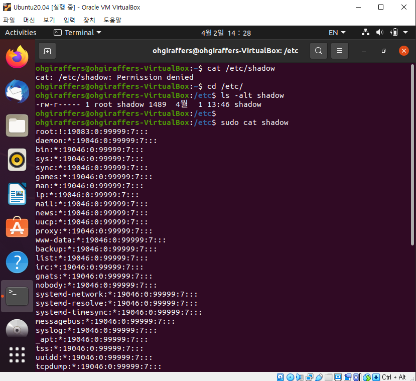
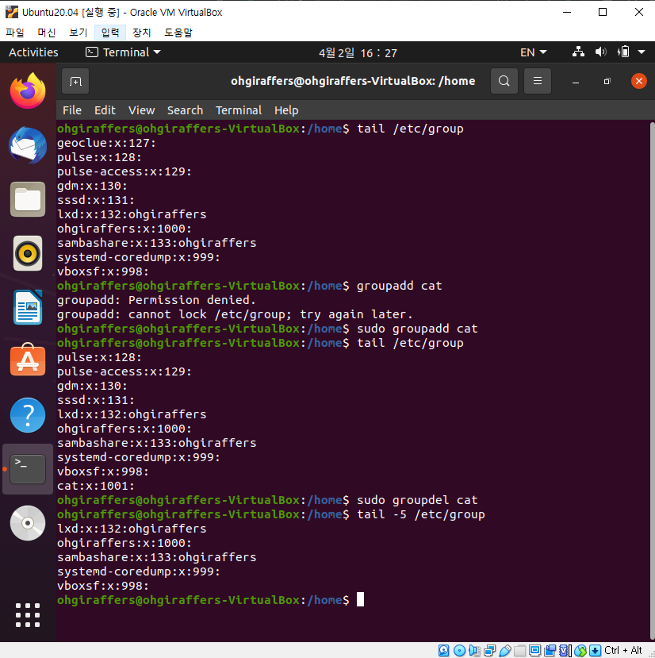

# 9. 우분투 계정과 권한 명령어

## 9-1. 들어가기 전에

### 9-1-1. Superuser 란?

- 시스템 운영 관리자 계정이다.
- 일반적으로 리눅스에선 root 유저를 의미한다.
- 일반 사용자 계정의 권한과 슈퍼유저의 권한을 구분하여 사용해야한다.
- 우분투의 경우 기본적으로 root 사용자를 비활성화한다.

### 9-1-2. whoami
> 현재 로그인되어 있는 사용자 계정을 확인하는 명령어이다.

### 9-1-3. id
> 현재 사용자가 가지고 있는 권한(그룹 포함)을 확인하는 명령어이다.
> 
> UID는 사용자의 아이디를 나타내며 0~32767 사이의 숫자로 나타내고 0은 슈퍼(root)유저를 나타낸다.
> - 0 : root
> - 1 ~ 99 : predefined
> - 100 ~ 999 : administrative and System accounts
> - 1000 ~ : user
> 
> GID는 사용자가 속한 그룹의 ID를 나타낸다.

### 9-1-4. cat /etc/passwd (or vi /etc/passwd)
> 현재 리눅스에 등록되어 있는 모든 계정을 확인하는 명령어이다. passwd 파일은 ":" 을 기준으로 데이터들을 구분한다.
> 
> 예를들어, root : x : 0 : 0 : root : /root : /bin/bash 이렇게 7개 필드로 구분된다.
> 각각의 필드를 왼쪽부터 설명하면
> - 계정 ID
> - 패스워드 (passwd 파일에는 암호가 저장되지 않고 /etc/shadow 파일에 해시화되서 저장된다)
> - 사용자 UID
> - 그룹 GID
> - 계정정보(보통은 사용자 이름)
> - 홈 디렉터리
> - 셸 환경

### 9-1-5. cat /etc/shadow : 사용자 암호 정보 확인
> shadow 파일은 슈퍼유저인 루트만 읽고 쓸수 있기 때문에 ohgiraffers 계정으론 확인할 수 없다.
> sudo로 루트권한을 빌려서 출력해본다.
> 
> 예를 하나 들어, root : ! : 19083 : 0 : 99999 : 7 : : : 왼쪽부터 설명하면 
> - 사용자명
> - 패스워드
>   - ! : locked
>   - $1$ : MD5
>   - $2a$ : Blowfish
>   - $2y$ : Blowfish
>   - $5$ : SHA-256
>   - $6$ : SHA-512
> - 최종 수정일
> - 패스워드 최소 변경일
> - 패스워드 최대 사용일
> - 만료 경고 기간
> - 유예 기간
> - 만료 기간

### 9-1-6 접근권한 간단정리
> 접근 권한은 크게 유저 본인, GROUP, OTHER 에 대해 설정할 수 있다.
>
> 맨 앞 d를 제외하고 차례대로 3단어씩 소유자의 권한, 소유주가 속한 그룹의 권한, 그 외 모든 이들의 권한이다.
> 접근권한은 보통 r:4, w:2, x:1 처럼 이진법으로 각 권한을 더한 값을 사용하기도 한다.
> 예를 들어 "ohgiraffes의 디렉터리의 접근 권한은 755 이다" 라고 할 수 있다. 소유자(4+2+1), 그룹(4+1), 그외(4+1) 과같이 계산한다. 
> - r : read 권한
> - w : wirte 권한
> - x : execute 권한

### 9-1-7. 권한 대여하기

- su [-] [username]
> 사용자의 권한을 대여하는 명령어이다. (즉, 사용자로 로그인한 효과를 나타낸다)
> 
> - su ohgiraffers : ohgiraffers의 ID로 로그인(해당 유저의 PW 입력해야함)
> - su - ohgiraffers : ohgiraffers의 ID로 로그인, ohgiraffers의 home 디렉터리도 사용 
> - sudo su - : 우분투에서도 root 로 로그인 (위험하니 자제할 것)
> - 권한 대여 종료는 exit로 할 수 있다.

## 9-2. 계정 관련 명령어

### 9-2-1. adduser
> 사용자 계정을 추가하는 명령어이다.
> 
> - adduser [OPTIONS] [--home DIR] [--shell SHELL] [--disabled-password] [--disabled-login] {username}
>
> 해당 명령어도 관리자 권한이 필요하기 때문에 sudo를 붙여서 실행한다.
> 해당 명령어를 실행하면 패스워드와 기타 정보를 입력해야한다. 패스워드는 필수로 입력한 후 기타 정보는 enter로 skip이 가능하다.
> 해당 과정을 거치면 계정생성 및 해당 계정의 디렉터리가 /home 밑에 자동 생성이 된다.

### 9-2-2. useradd
> 사용자 계정을 추가하는 명령어지만, 해당 명령어는 계정만 생성하며, 암호와 유저디렉터리 설정은 자동으로 해주지 않는다.

### 9-2-3. usermod
> 사용자 계정 정보를 변경할 수 있는 명령어이다.
> 
> usermod [OPTIONS] {username}

| 옵션 | 설명 |
| :---: | --- |
| -u | 사용자 UID를 변경할 수 있다.|
| -d | 사용자 홈 디렉터리를 변경할 수 있다.(홈 디렉터리는 미리 생성해 두어야 한다)|

### 9-2-4. userdel
> 사용자 계정을 삭제하는 명령어이다. 
> 
> userdel [OPTIONS] {username}

| 옵션 | 설명 |
| :---: | --- |
| -f | 사용자라 로그인 중이라도 강제 삭제|
| -r | 사용자와 함께 사용자 디렉터리, 사용자 메일함도 삭제|                     

## 9-3. 그룹 관련 명령어

### 9-3-1. groupadd 
> 그룹을 축하는 명령어이다. 
> 
> 그룹에는 보통 GID가 부여된다. 위 명령어로 그룹 추가시에는 이전에 추가된 그룹번호에서 +1이 자동으로 추가되어 생성된다.
> 
> groupadd [OPTIONS] {groupname}

| 옵션 | 설명 |
| :---: | --- |
| -g | 그룹번호를 지정할 수 있다.(기존 그룹번호와 중복 불가)|

### 9-3-2. groupdel
> 그룹을 삭제하는 명령어이다.
> 
> groupdel {groupname}

### 9-3-3. 유용한 Group 관련 명령어

| 명령어 | 설명 |
|------| -----|
| tail /etc/group | GID와 함께 Group List 조회 |
| groups | GID 제외하고 Group List 조회 |
| gpasswd -a {username} {groupname} | 특정 유저를 특정 그룹에 추가 |
| gpasswd -A {username} {groupname} | 그룹 멤버 중 특정 유저를 관리자로 설정 |
| gpasswd -d {username} {groupname} | 유저를 특정 그룹에서 제거 |
| gpasswd {groupname} | 특정 그룹의 패스워드 설정/변경 |
| gpasswd -r {groupname} | 특정 그룹의 패스워드 제거 |
| useradd -G {groupname} {username} | 계정 생성시 그룹에 추가 |

## 9-4. 파일 권한 관련 명령어

### 9-4-1. umask
> 파일/디렉터리 생성 권한을 확인하는 명령어이다.
> 
> umask가 0인 경우
> - 리눅스의 기본 파일 권한 : 666
> - 리눅스의 기본 디렉터리 권한 : 777
> 
> umask가 0이 아닌 경우는 계산이 필요하다.

### 9-4-2. chmod
> 파일 또는 디렉터리의 권한을 변경하는 명령어이다. 권한 변경은 슈퍼유저나 파일/디렉터리 소유주만 가능하다.
> 
> chmod [OPTIONS] [MODE] {file/directory}
> - -R : 디렉터리일경우 하위 모든 파일/디렉터리 권한도 변경한다. 

| 구분 | 기호 | 설명 |
| ----| ----| -----|
| 접근권한 | r | 읽기 |
| 접근권한 | w | 쓰기 |
| 접근권한 | x | 실행 |
| 수행할 연산 | + | 권한 추가 |
| 수행할 연산 | - | 권한 제거 |
| 수행할 연산 | = | 권한 부여 |
| 사용자 | u | user의 약자, 소유자 |
| 사용자 | g | group의 약자, 그룹 |
| 사용자 | o | other의 약자, 그외 |
| 사용자 | a | all 약자, 모든 사용자 |
| 사용자 |   | 문자가 없으면 a와 동일하게 적용 |

> 예시
> 
> - ug+r : 소유자와 그룹에 읽기 권한 추가
> - +rx  : 모든 사용자에게 읽기/쓰기 권한 추가
> - u=rwx : 소유자에게 읽기, 쓰기, 실행 권한 부여
> - u-x  : 소유주에게 실행 권한 제거
> - g+x,o+x : 그룹과 기타 사용자에게 실행권한 추가

### 9-4-3. chown
> 파일 또는 디렉터리의 소유권을 변경하는 명령어이다.
> 
> chown [OPTIONS] {바꾸고 싶은 username}{:바꾸고 싶은 groupname} {소유권을 변경하고자 하는 파일/디렉터리}
> 
> - -R : 하위 디렉터리까지 모든 소유권 적용

- 특정 파일 소유권 변경

- 하위 모든 파일/디렉터리 소유권 변경

